# 🌍 Hệ Thống Giám Sát Chất Lượng Không Khí Đô Thị

Đồ án tốt nghiệp — Đại học Bách khoa Hà Nội

Hệ thống IoT để đo và theo dõi chất lượng không khí theo thời gian thực. Các sensor node (ESP32 + cảm biến) đo bụi mịn PM2.5/PM10, CO₂, TVOC, nhiệt độ, độ ẩm rồi gửi dữ liệu qua LoRa 433MHz về gateway. Gateway kết nối WiFi đẩy dữ liệu lên server, hiển thị trên web dashboard cho người dùng xem.

## Kiến trúc tổng quan

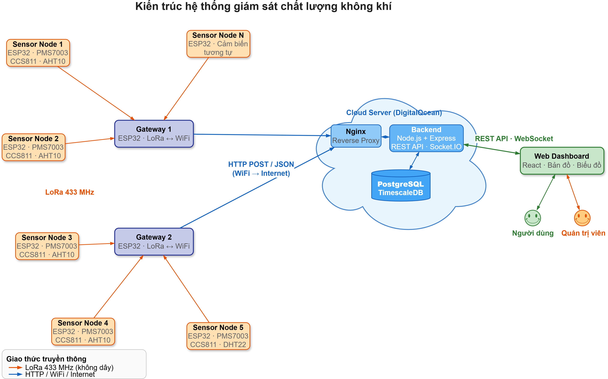

Tóm tắt luồng: **Sensor Node** → LoRa → **Gateway** → HTTP → **Backend (Node.js)** → WebSocket → **Web Dashboard (React)**

Database dùng PostgreSQL + TimescaleDB để lưu dữ liệu chuỗi thời gian, PostGIS để tính toán vị trí.

## Thiết bị thực tế

Mỗi sensor node gồm ESP32, cảm biến PMS7003 (bụi mịn), CCS811 (CO₂/TVOC), AHT10 (nhiệt độ/độ ẩm), module LoRa AS32-TTL-100, màn hình OLED, pin 18650. Tất cả đặt trong hộp in 3D.

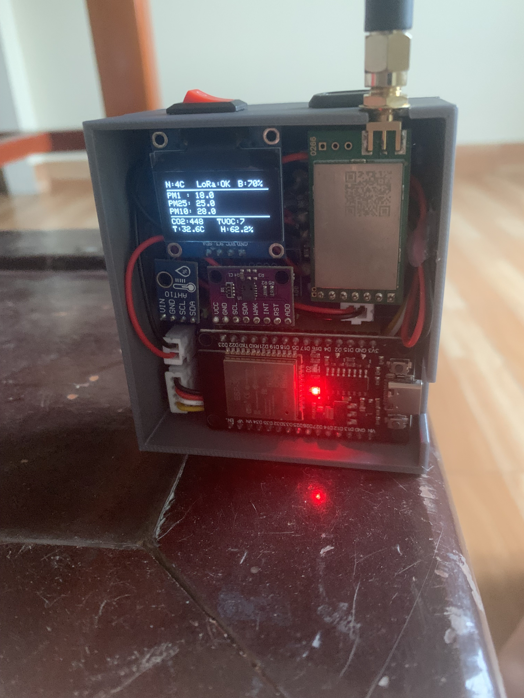

---

## Giao diện người dùng

### Trang tổng quan (Dashboard)

Người dùng mở web lên sẽ thấy ngay chỉ số AQI, PM2.5, PM10, CO₂, nhiệt độ, độ ẩm của trạm gần nhất. Có bản đồ AQI khu vực, biểu đồ lịch sử, khuyến nghị sức khỏe và thời tiết hiện tại.

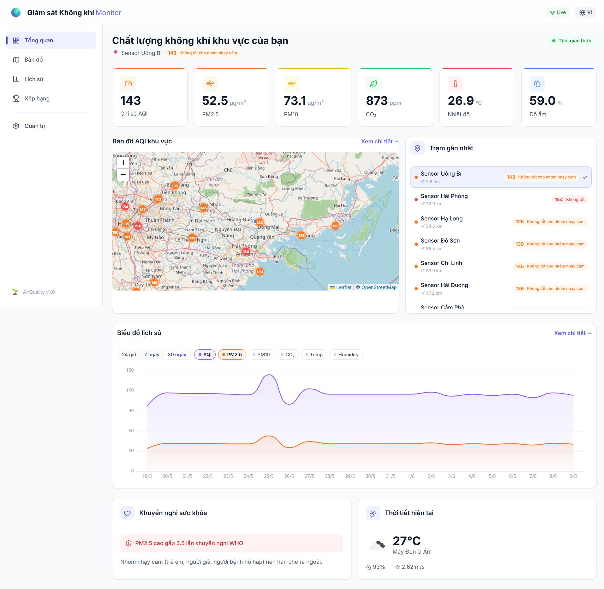

### Bản đồ AQI

Bản đồ hiển thị tất cả các trạm quan trắc trên cả nước, click vào từng trạm để xem chi tiết. Màu sắc marker thay đổi theo mức AQI (xanh → vàng → cam → đỏ).

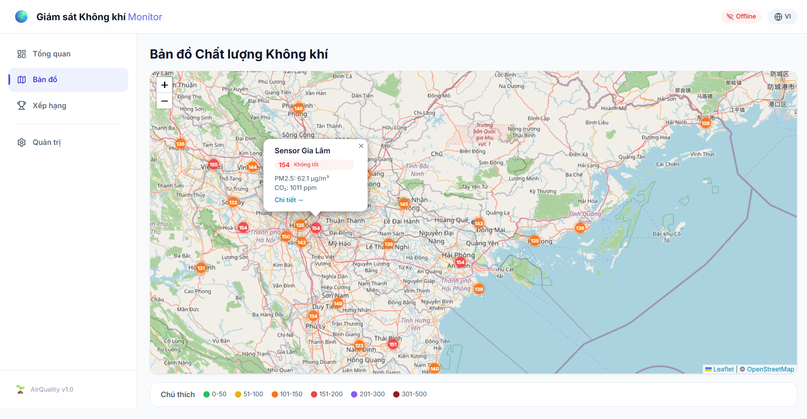

### Lịch sử dữ liệu

Xem biểu đồ lịch sử theo từng trạm, chọn khoảng thời gian 24h / 7 ngày / 30 ngày, chọn loại chỉ số cần xem.

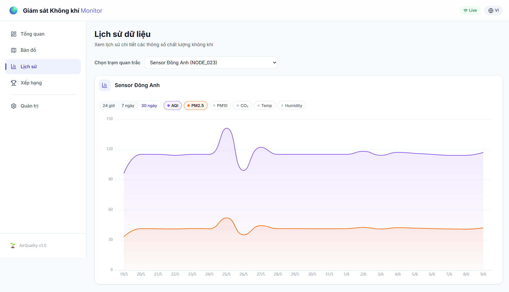

### Xếp hạng ô nhiễm

Sắp xếp các trạm theo AQI từ cao đến thấp, dễ so sánh giữa các khu vực.

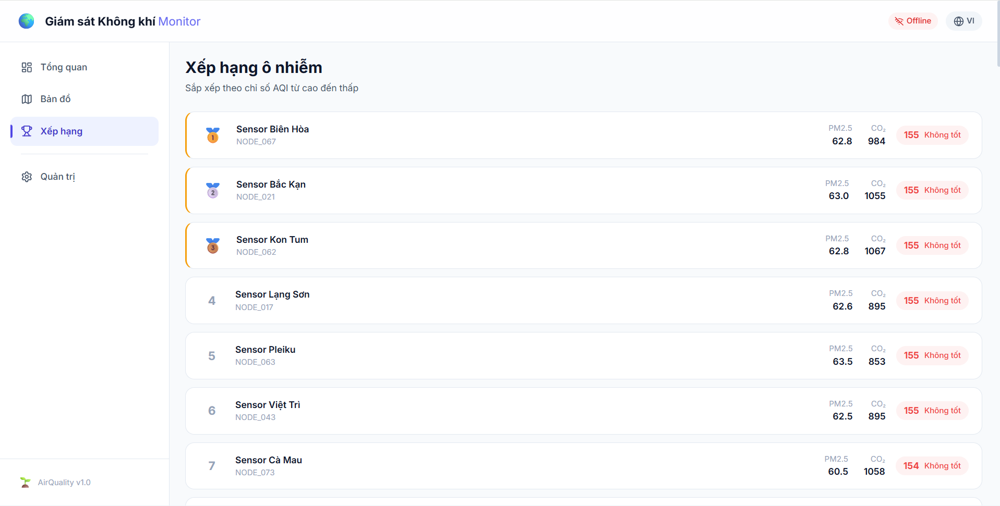

---

## Giao diện quản trị (Admin)

### Tổng quan hệ thống

Admin đăng nhập vào sẽ thấy tổng quan: số lượng node/gateway, cảnh báo chờ xử lý, AQI trung bình, tình trạng thiết bị, hoạt động gần đây.

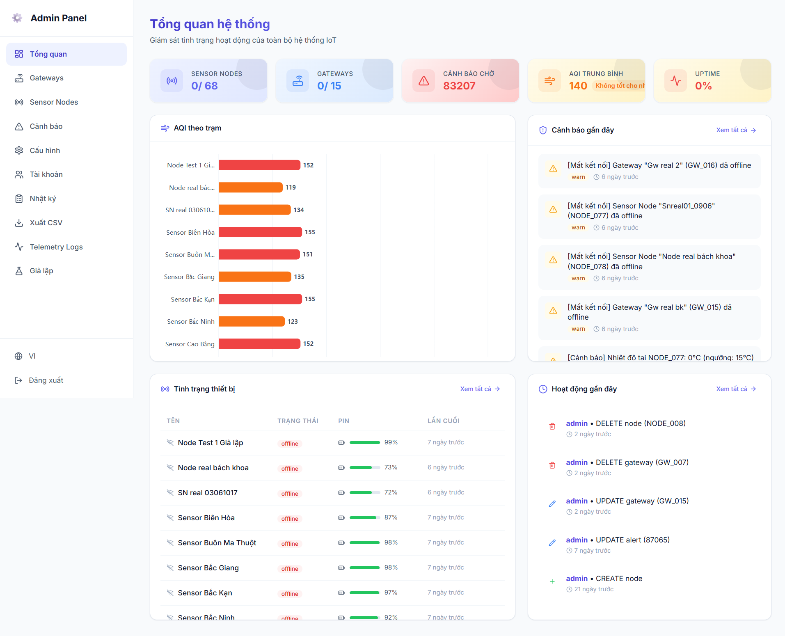

### Quản lý thiết bị (Sensor Nodes)

Xem danh sách tất cả sensor node, trạng thái online/offline, mức pin, RSSI, gateway kết nối, thời gian cập nhật cuối.

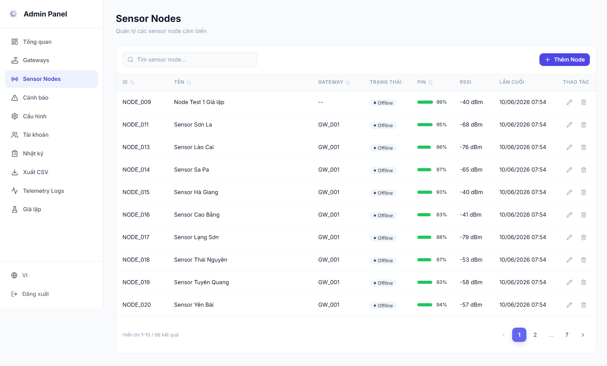

### Cảnh báo

Danh sách cảnh báo khi thiết bị mất kết nối hoặc chỉ số vượt ngưỡng. Có lọc theo thiết bị, mức độ, trạng thái xác nhận.

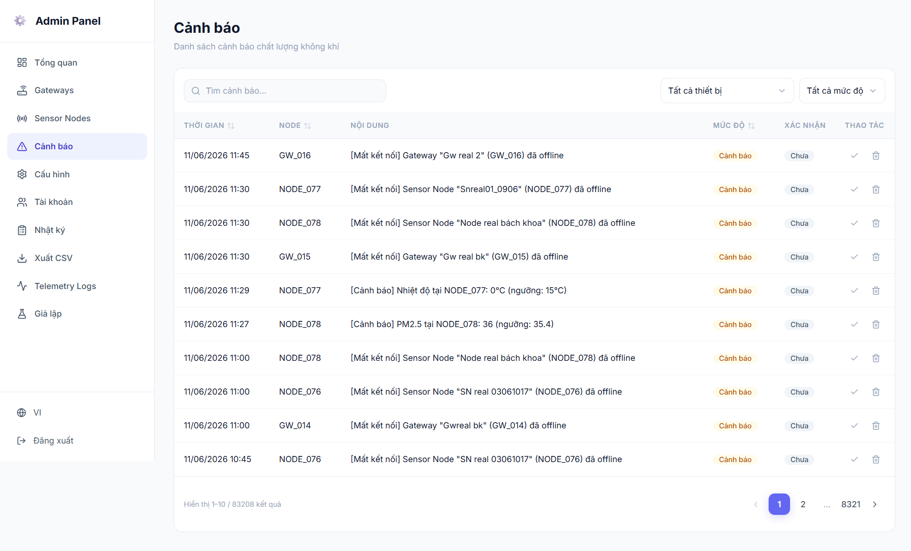

### Cấu hình ngưỡng

Chỉnh ngưỡng cảnh báo và ngưỡng nguy hiểm cho từng chỉ số (PM2.5, PM10, CO₂, TVOC, nhiệt độ), cài khoảng cách lấy mẫu.

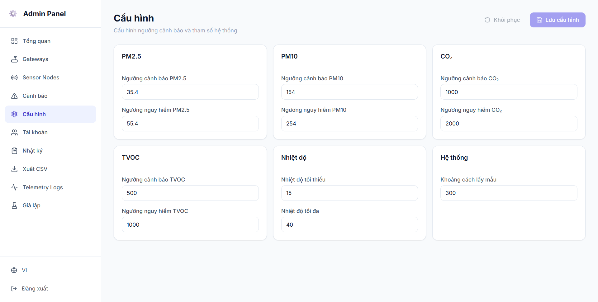

### Quản lý tài khoản

Tạo, sửa, xóa tài khoản admin.

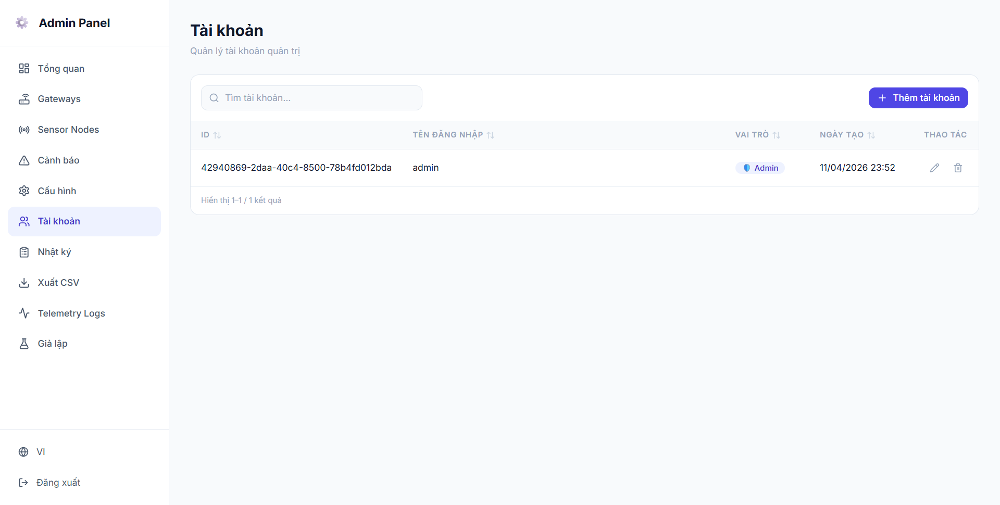

### Nhật ký hệ thống

Ghi lại toàn bộ thao tác của admin (tạo/sửa/xóa node, gateway, cảnh báo...) để kiểm soát.

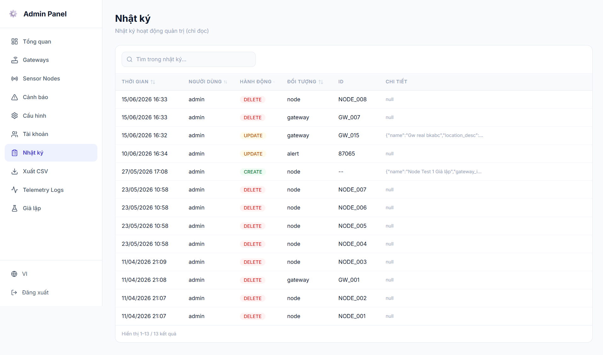

### Xuất dữ liệu CSV

Chọn sensor node và khoảng thời gian để xuất dữ liệu đo lường ra file CSV.

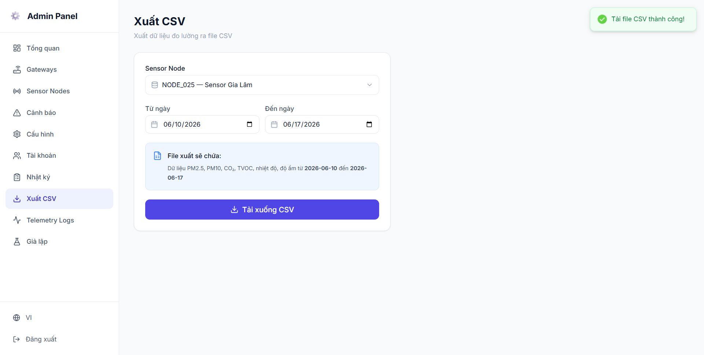

---

## Công nghệ sử dụng

| Thành phần | Công nghệ |
|---|---|
| Firmware | ESP32, FreeRTOS, PlatformIO |
| Truyền thông | LoRa AS32-TTL-100 (433 MHz, UART) |
| Backend | Node.js, Express, Prisma ORM, Socket.IO |
| Database | PostgreSQL + TimescaleDB + PostGIS |
| Frontend | React, Vite, ECharts, Leaflet, Socket.IO |
| Deploy | Docker, PM2, Nginx, DigitalOcean |

## Cấu trúc thư mục

```
datn/
├── firmware/          # Firmware ESP32 (PlatformIO)
│   ├── sensor-node/   # FreeRTOS: đọc cảm biến + gửi LoRa
│   └── gateway/       # Nhận LoRa + gửi HTTP lên server
├── backend/           # Node.js API server
├── frontend/          # React web dashboard
├── nginx/             # Cấu hình reverse proxy
├── docs/              # Tài liệu
└── docker-compose.yml
```

## Quick Start

```bash
# 1. Clone
git clone <repository-url>
cd datn

# 2. Database
docker compose up -d

# 3. Backend
cd backend && npm install
npx prisma generate
npm run dev              # http://localhost:3000

# 4. Frontend
cd frontend && npm install
npm run dev              # http://localhost:5173

# 5. Firmware (nếu có ESP32)
cd firmware/sensor-node
pio run -e esp32dev -t upload --upload-port <COM_PORT>
```
