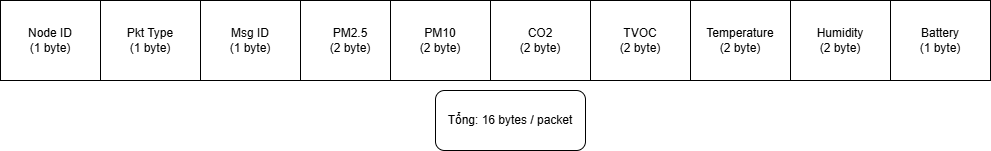

# Tìm hiểu về mạng Lora và thiết kế gói tin

### **Phần 1: Tổng quan về LoRa và Cách sử dụng**

**LoRa (Long Range)** là một công nghệ truyền thông không dây tầm xa, tiêu thụ điện năng thấp. **LoRa P2P (Point-to-Point)** hoặc mạng hình sao tự xây dựng (Star topology: nhiều Node gửi đến môt Gateway).

Để sử dụng LoRa hiệu quả, bạn cần nắm vững **4 thông số cốt lõi** sau (thường được cấu hình qua thư viện như `LoRa.h` của Sandeep Mistry hoặc `RadioLib` trên ESP32):

1. **Tần số (Frequency):** Module SX1278 hoạt động ở dải **433 MHz** (ở Việt Nam và châu Á, dải này hợp lệ cho thiết bị công suất thấp). Các module muốn giao tiếp với nhau phải set chung một tần số.
2. **Spreading Factor (SF - Hệ số lan truyền):** Từ SF7 đến SF12.
    - **SF thấp (SF7, SF8):** Tốc độ truyền nhanh, thời gian phát ngắn (ít tốn pin), nhưng khoảng cách ngắn. (Dùng cho trong nhà, khoảng cách < 1km).
    - **SF cao (SF11, SF12):** Tốc độ truyền rất chậm, tốn pin hơn nhưng có thể truyền cực xa (phá xuyên tường tốt, có thể lên đến 5-10km).
3. **Bandwidth (BW - Băng thông):** Thường để **125 kHz**. Băng thông rộng hơn (250kHz) thì truyền nhanh hơn nhưng độ nhạy thu giảm.
4. **Sync Word:** Một mã định danh (từ 0x00 đến 0xFF) để Gateway và Node phân biệt mạng của bạn với các mạng LoRa khác xung quanh. (Cả Node và Gateway phải chung Sync Word).

---

### **Phần 2: Nguyên tắc Thiết kế gói tin (Packet Design)**

Với Wifi hay MQTT, ta có thể thoải mái dùng chuỗi **JSON** (ví dụ: `{"node":1, "temp":25.5, "pm25":12}`). Nhưng với **LoRa thì TUYỆT ĐỐI KHÔNG NÊN dùng JSON** hay chuỗi `String` dài.

**Lý do:**

- LoRa có tốc độ data rate rất thấp (chỉ khoảng vài chục đến vài trăm byte mỗi giây).
- Gói tin càng dài (Time-on-Air lớn): Càng tốn pin, càng dễ bị nhiễu làm hỏng gói tin, và vi phạm quy định về thời gian phát sóng (Duty Cycle).
- Payload tối đa của SX1278 chỉ là **255 bytes**.

**Giải pháp:** đóng gói dữ liệu thành các dạng cơ bản (byte/nhị phân) bằng cách dùng **`struct`** (Cấu trúc) trong C/C++.

---

### **Phần 3: thiết kế gói tin thực tế cho dự án**

### **Bước 1: Định nghĩa cấu trúc gói tin (Struct)**

Thay vì gửi số float (4 bytes) cho nhiệt độ, ta nhân với 10 và gửi số nguyên (2 bytes) để tiết kiệm. Ví dụ: `25.5°C` -> gán thành `255`. Lên Gateway chia lại cho 10.

[LoraPacket.drawio - draw.io](https://app.diagrams.net/#G1a8xmH-gZk6npoodEED70bWXKSlwJTz_L#%7B%22pageId%22%3A%22TTCriTzf1GsX2TdNFFsn%22%7D)



- **Node ID (1 byte)**: Định danh node (0x01 → 0xFF, tối đa 255 node).
- **Pkt Type (1 byte)**: Loại gói tin (Ví dụ: `0x01` là Data đọc từ cảm biến, `0x02` là Heartbeat cảnh báo, v.v.).
- **Msg ID (1 byte)**: Bộ đếm gói tin (0-255), tự động tăng sau mỗi lần gửi để phát hiện nếu có gói tin bị rớt/mất trên đường truyền.
- **PM2.5/PM10 (4 bytes - mỗi loại 2 bytes)**: Giá trị bụi mịn (µg/m³ × 10) để giữ lại 1 chữ số thập phân.
- **CO2 (2 bytes)**: Nồng độ khí CO₂ (ppm), có dải đo từ 400 đến 8192.
- **TVOC (2 bytes)**: Tổng lượng chất hữu cơ dễ bay hơi trong không khí (ppb), dải đo từ 0 đến 1187.
- **Temp (2 bytes)**: Nhiệt độ môi trường (°C × 10) để giữ 1 chữ số thập phân (có thể là số âm).
- **Humidity (2 bytes)**: Độ ẩm môi trường (% × 10) để giữ 1 chữ số thập phân.
- **Battery (1 byte)**: Trạng thái mức pin còn lại của Sensor Node, định dạng từ 0-100%.

### **Bước 1: Khai báo Struct (Dùng chung cho cả Node và Gateway)**

```cpp
cpp
// Thêm __attribute__((packed)) để báo compiler không tự động thêm thẻ padding
// giúp tối ưu tuyệt đối kích thước.
typedefstruct __attribute__((packed)) {
uint8_t  nodeId;       // 1 byte  - Định danh node (1-255)
uint8_t  pktType;      // 1 byte  - Loại gói tin (Ví dụ: 0x01 là Data)
uint8_t  msgId;        // 1 byte  - Số thứ tự gói tin để check rớt mạng (0-255)
uint16_t pm25;         // 2 bytes - Bụi PM2.5 (µg/m³ x 10)
uint16_t pm10;         // 2 bytes - Bụi PM10 (µg/m³ x 10)
uint16_t co2;          // 2 bytes - Nồng độ CO2 (ppm)
uint16_t tvoc;         // 2 bytes - Nồng độ TVOC (ppb)
int16_t  temperature;  // 2 bytes - Nhiệt độ (°C x 10)
uint16_t humidity;     // 2 bytes - Độ ẩm (% x 10)
uint8_t  battery;      // 1 byte  - Phần trăm pin (0-100%)
} SensorPayload;
```

---

### **Bước 2: Code tại Sensor Node (TX - Gửi dữ liệu)**

```cpp
cpp
#include<LoRa.h>

SensorPayload myData;
uint8_t messageCount =0; // Bộ đếm Msg ID (0-255)

void sendLoRaData() {
  // 1. Cập nhật Header vào struct
  myData.nodeId =1;             // Định danh Node 1
  myData.pktType =0x01;         // Gói Data (0x01)
  myData.msgId = messageCount++; // Lưu bộ đếm hiện tại rồi tăng lên 1

  // 2. Đọc cảm biến (Ví dụ)
float pm25_val = pms.getPM25(); // Giả sử 12.5
float pm10_val = pms.getPM10(); // Giả sử 15.0
float t = dht.readTemperature(); // Giả sử 25.4
float h = dht.readHumidity();    // Giả sử 60.5

  // 3. Nạp dữ liệu vào struct (Nhân 10 để ép về số nguyên)
  myData.pm25 = (uint16_t)(pm25_val *10.0); // Lưu 125
  myData.pm10 = (uint16_t)(pm10_val *10.0); // Lưu 150
  myData.co2 = ccs.geteCO2();                // Lưu 450
  myData.tvoc = ccs.getTVOC();               // Lưu 120
  myData.temperature = (int16_t)(t *10.0);  // Lưu 254
  myData.humidity = (uint16_t)(h *10.0);    // Lưu 605
  myData.battery = getBatteryPercentage();   // Lưu 85

  // 4. Gửi đi qua LoRa (Truyền nguyên khối memory bao gồm 16 bytes)
  LoRa.beginPacket();
  LoRa.write((uint8_t *)&myData,sizeof(SensorPayload));
  LoRa.endPacket();

  Serial.printf("Đã gửi gói tin LoRa: %d bytes\n",sizeof(SensorPayload));
}
```

---

### **Bước 3: Code tại Gateway (RX - Nhận dữ liệu)**

```cpp
cpp
#include<LoRa.h>

SensorPayload receivedData;

void onReceive(int packetSize) {
  // Kiểm tra xem dung lượng gói tin tới có đúng 16 byte của struct không
if (packetSize !=sizeof(SensorPayload)) {
    Serial.println("Lỗi: Kích thước gói tin không đúng (Bỏ qua)");
return;
  }

  // Đọc nguyên chuỗi byte đẩy thẳng vào memory của struct
  LoRa.readBytes((uint8_t *)&receivedData, packetSize);

  // Lấy các thông số độ mạnh sóng của LoRa
int rssi = LoRa.packetRssi();
float snr = LoRa.packetSnr();

  // Khôi phục lại dữ liệu ban đầu (Chia 10)
float realPm25 = receivedData.pm25 /10.0;
float realPm10 = receivedData.pm10 /10.0;
float realTemp = receivedData.temperature /10.0;
float realHum = receivedData.humidity /10.0;

  // In ra màn hình Serial để debug kiểm tra
  Serial.println("-----------------------------------------");
  Serial.printf("Nhận từ Node %d | MsgID: %d | PktType: 0x%02X | RSSI: %d dBm | SNR: %.2f\n",
                 receivedData.nodeId, receivedData.msgId, receivedData.pktType, rssi, snr);

  Serial.printf("PM2.5: %.1f µg/m³ | PM10: %.1f µg/m³\n", realPm25, realPm10);
  Serial.printf("CO2: %d ppm | TVOC: %d ppb\n", receivedData.co2, receivedData.tvoc);
  Serial.printf("Nhiệt độ: %.1f C | Độ ẩm: %.1f %%\n", realTemp, realHum);
  Serial.printf("Pin Node: %d%%\n", receivedData.battery);
  Serial.println("-----------------------------------------");

  // Xử lý tạo chuỗi JSON để đẩy lên Web (VD Node.js backend)
}
```

### **Tóm tắt các lưu ý bảo mật & nâng cao (Tùy chọn):**

**Tránh nhiễu dữ liệu:** Thông số `msgId` giúp Gateway biết có gói tin nào bị rớt dọc đường hay không. Đoạn tính **RSSI** và **SNR** giúp bạn đánh giá được chất lượng đường truyền, để chỉnh lại SF cho phù hợp.