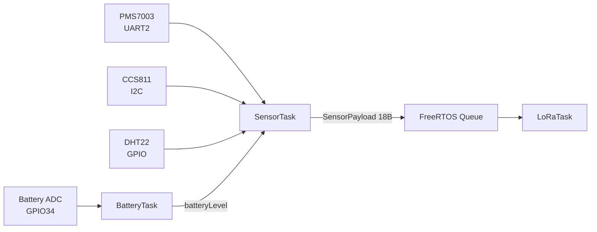
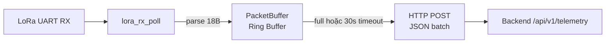
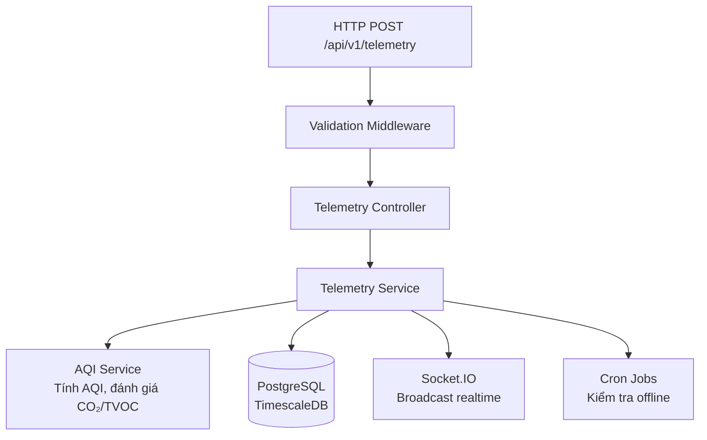
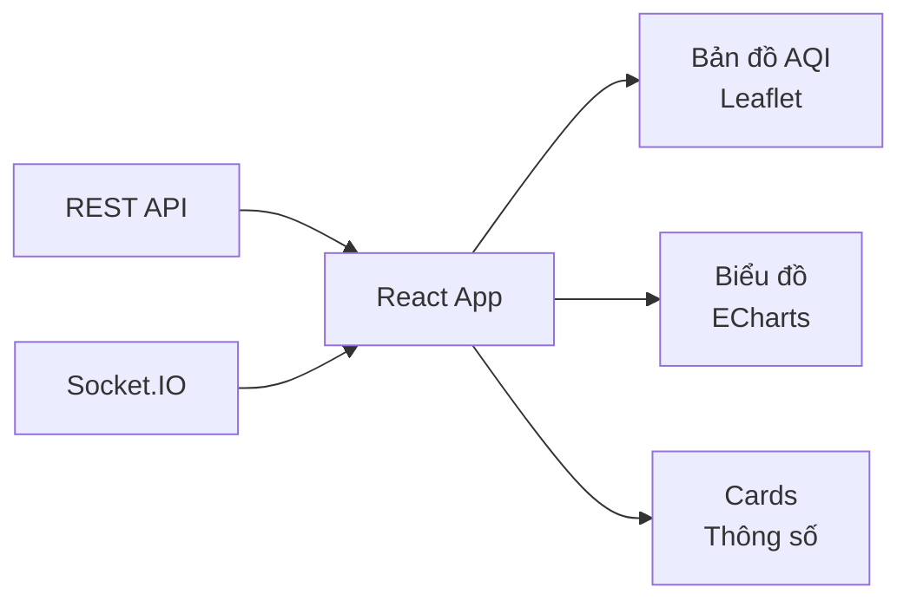

# Data Flow — Luồng Dữ liệu End-to-End

## Tổng quan

Dữ liệu đi qua 4 giai đoạn chính từ cảm biến vật lý đến dashboard người dùng.

```
Sensor Node ──LoRa 18B──→ Gateway ──HTTP POST──→ Backend Server ──Socket.IO──→ Frontend
                          (UART)    (JSON batch)  (Prisma → DB)    (realtime)   (React)
```

---

## Giai đoạn 1: Thu thập dữ liệu (Sensor Node)



**Chi tiết:**
1. `SensorTask` bật quạt PMS7003, chờ warm-up 30 giây
2. Trong lúc warm-up, đọc DHT22 (nhiệt độ, độ ẩm) và CCS811 (CO₂, TVOC)
3. Sau warm-up, đọc PMS7003 (PM2.5, PM10), tắt quạt
4. Đóng gói thành `SensorPayload` struct (18 bytes), gửi vào FreeRTOS Queue
5. `LoRaTask` lấy payload từ Queue, gửi qua LoRa UART

**Cấu trúc gói tin LoRa (18 bytes):**

| Trường | Kích thước | Kiểu | Mô tả |
|---|---|---|---|
| Node ID | 1 byte | `uint8_t` | Định danh node (1–255) |
| Pkt Type | 1 byte | `uint8_t` | Loại gói: `0x01` = Data, `0x02` = Heartbeat |
| Msg ID | 1 byte | `uint8_t` | Counter phát hiện mất gói (0–255) |
| PM2.5 | 2 bytes | `uint16_t` | µg/m³ × 10 |
| PM10 | 2 bytes | `uint16_t` | µg/m³ × 10 |
| CO₂ | 2 bytes | `uint16_t` | ppm |
| TVOC | 2 bytes | `uint16_t` | ppb |
| Temperature | 2 bytes | `int16_t` | °C × 10 (có dấu) |
| Humidity | 2 bytes | `uint16_t` | % × 10 |
| Battery | 1 byte | `uint8_t` | 0–100% |

---

## Giai đoạn 2: Trung chuyển (Gateway)



**Chi tiết:**
1. Gateway poll UART mỗi 100ms để nhận gói LoRa
2. Parse 18 bytes binary thành struct, lưu vào ring buffer (ISR-safe, portMUX spinlock)
3. Khi buffer đầy hoặc hết timeout 30 giây, serialize thành JSON batch
4. HTTP POST đến server API `/api/v1/telemetry` (retry × 3)

**JSON payload gửi lên server:**

```json
{
  "gateway_id": "GW_001",
  "readings": [
    {
      "node_id": "NODE_001",
      "pm25": 12.5,
      "pm10": 18.3,
      "co2": 485,
      "tvoc": 120,
      "temperature": 28.5,
      "humidity": 65.2,
      "battery": 85,
      "rssi": 0
    }
  ]
}
```

---

## Giai đoạn 3: Xử lý & Lưu trữ (Backend Server)



**Chi tiết:**
1. Gateway POST gửi đến `/api/v1/telemetry`
2. Validation middleware kiểm tra format, gateway_id hợp lệ
3. Telemetry Service:
   - Lưu dữ liệu thô vào bảng `measurements` (TimescaleDB Hypertable)
   - Cập nhật `last_seen`, `battery_level`, `lora_rssi` cho sensor node
   - Cập nhật `status` gateway thành `online`
4. AQI Service tính chỉ số AQI (US EPA) từ PM2.5/PM10
5. Socket.IO broadcast dữ liệu mới cho tất cả frontend clients
6. Cron job chạy định kỳ kiểm tra thiết bị offline

---

## Giai đoạn 4: Hiển thị (Frontend)



**Chi tiết:**
1. Frontend gọi REST API lấy dữ liệu lịch sử, danh sách trạm
2. Kết nối Socket.IO nhận dữ liệu realtime
3. Hiển thị trên:
   - Bản đồ AQI (Leaflet) — các trạm đánh dấu bằng chấm màu theo mức AQI
   - Biểu đồ lịch sử (ECharts) — biểu đồ cột theo giờ/ngày
   - Cards thông số — AQI, PM2.5, CO₂, nhiệt độ, độ ẩm
   - Gauge — hiển thị AQI hiện tại
