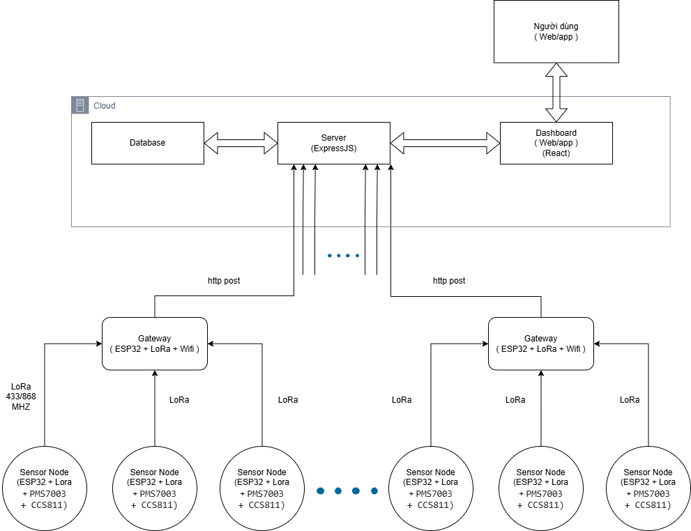

# System Overview — Tổng quan Kiến trúc Hệ thống

## 1. Giới thiệu

**Hệ thống giám sát chất lượng không khí đô thị** là một giải pháp IoT hoàn chỉnh, đo lường các chỉ số bụi mịn (PM2.5/PM10), khí độc (CO₂/TVOC), nhiệt độ và độ ẩm, sau đó truyền dữ liệu qua mạng LoRa về server và hiển thị trên dashboard web thời gian thực.

| Thuộc tính | Giá trị |
|---|---|
| **Tên đề tài** | Hệ thống giám sát chất lượng không khí đô thị sử dụng mạng cảm biến không dây LoRa |
| **Phần cứng** | ESP32, LoRa AS32-TTL-100 (UART), PMS7003, CCS811, DHT22 |
| **Backend** | Node.js (Express) + Prisma + PostgreSQL (TimescaleDB + PostGIS) |
| **Frontend** | React + Vite + ECharts + Leaflet |

---

## 2. Sơ đồ kiến trúc



```
┌───────────────┐   LoRa 433MHz (UART)   ┌───────────────┐   HTTP POST    ┌─────────────────────────────────┐
│  Sensor Node  │ ──────────────────────▶ │    Gateway    │ ────────────▶ │          Cloud Server           │
│  ESP32 + LoRa │                         │  ESP32 + LoRa │               │                                 │
│  PMS7003      │                         │  + WiFi       │               │ ┌─────────┐  ┌───────────────┐  │
│  CCS811       │                         │               │               │ │ Express │  │  PostgreSQL   │  │
│  DHT22        │                         └───────────────┘               │ │ Server  │──│ TimescaleDB   │  │
└───────────────┘                                                         │ │         │  │ + PostGIS     │  │
                                                                          │ └────┬────┘  └───────────────┘  │
┌───────────────┐   LoRa                                                  │      │                          │
│  Sensor Node  │ ──────────▶  (cùng Gateway)                             │      │ Socket.IO                │
│  #2, #3, ...  │                                                         │      ▼                          │
└───────────────┘                                                         │ ┌──────────┐                    │
                                                                          │ │Dashboard │ ◀── Người dùng     │
                                                                          │ │(React)   │                    │
                                                                          │ └──────────┘                    │
                                                                          └─────────────────────────────────┘
```

---

## 3. Các thành phần chính

### 3.1. Sensor Node (Node cảm biến)

| Thuộc tính | Chi tiết |
|---|---|
| **MCU** | ESP32 DevKit V1 |
| **LoRa** | Module AS32-TTL-100 (UART, 433 MHz) |
| **Cảm biến** | PMS7003 (PM2.5/PM10), CCS811 (CO₂/TVOC), DHT22 (nhiệt độ/độ ẩm) |
| **Nguồn** | Pin 18650 + TP4056 |
| **RTOS** | FreeRTOS — 4 task: SensorTask, LoRaTask, BatteryTask, WatchdogTask |
| **Chu kỳ gửi** | Mỗi 5 phút |

→ Chi tiết: [firmware/sensor-node.md](../firmware/sensor-node.md)

### 3.2. Gateway (Trạm trung chuyển)

| Thuộc tính | Chi tiết |
|---|---|
| **MCU** | ESP32 DevKit V1 |
| **LoRa** | Module AS32-TTL-100 (UART) |
| **Kết nối** | WiFi → HTTP POST đến server |
| **Kiến trúc** | Superloop (không dùng FreeRTOS) |
| **Buffer** | Ring buffer ISR-safe (portMUX spinlock) |

→ Chi tiết: [firmware/gateway.md](../firmware/gateway.md)

### 3.3. Backend Server

| Thuộc tính | Chi tiết |
|---|---|
| **Runtime** | Node.js |
| **Framework** | Express.js |
| **ORM** | Prisma |
| **Database** | PostgreSQL + TimescaleDB + PostGIS |
| **Realtime** | Socket.IO |
| **Auth** | JWT + bcrypt |

→ Chi tiết: [backend/server-architecture.md](../backend/server-architecture.md)

### 3.4. Frontend Dashboard

| Thuộc tính | Chi tiết |
|---|---|
| **Framework** | React 19 + Vite 6 |
| **State** | Zustand (auth + telemetry stores) |
| **Routing** | React Router 7 (13 lazy-loaded routes) |
| **Biểu đồ** | ECharts (bar chart lịch sử 24h) |
| **Bản đồ** | Leaflet + react-leaflet (AQI markers, popups) |
| **Realtime** | Socket.IO Client |
| **Styling** | CSS Modules + Design Tokens |
| **i18n** | react-i18next (VI/EN) |
| **UI Pages** | 5 trang User + 8 trang Admin |

→ Chi tiết: [frontend/frontend-architecture.md](../frontend/frontend-architecture.md)

---

## 4. Cấu trúc thư mục dự án

```
datn/
├── backend/                    # Backend Node.js server
│   ├── database/               # SQL init scripts
│   ├── prisma/                 # Prisma schema
│   ├── src/
│   │   ├── config/             # Prisma client config
│   │   ├── controllers/        # Request handlers
│   │   ├── middlewares/        # Auth, validation middleware
│   │   ├── routes/             # API route definitions
│   │   ├── services/           # Business logic (AQI, cron, export...)
│   │   ├── validations/        # Input validation
│   │   ├── utils/              # Utility functions
│   │   └── server.js           # Entry point
│   └── package.json
├── firmware/                   # Firmware ESP32 (PlatformIO)
│   ├── sensor-node/            # Firmware cho sensor node
│   │   ├── src/
│   │   │   ├── drivers/        # Hardware drivers (PMS7003, CCS811, DHT22, LoRa, Battery)
│   │   │   ├── tasks/          # FreeRTOS tasks
│   │   │   ├── common/         # Shared structs, debug macros
│   │   │   ├── rtos/           # Queue, semaphore declarations
│   │   │   └── main.cpp
│   │   └── test/               # Test files cho từng module
│   └── gateway/                # Firmware cho gateway
│       ├── src/
│       │   ├── drivers/        # LoRa receiver, WiFi manager
│       │   ├── core/           # Packet buffer
│       │   ├── common/         # Shared structs
│       │   ├── net/            # HTTP client
│       │   └── main.cpp
│       └── test/
├── frontend/                   # Frontend React (hoàn thành)
│   ├── src/
│   │   ├── components/        # 10 UI components (DataTable, Modal, Badge...)
│   │   ├── pages/user/        # 5 trang: Dashboard, Map, Ranking, Detail, 404
│   │   ├── pages/admin/       # 8 trang: Login, Dashboard, CRUD, Config, Export
│   │   ├── services/          # 6 API services (Axios)
│   │   ├── hooks/             # 5 custom hooks (dashboard, weather, socket...)
│   │   ├── stores/            # 2 Zustand stores (auth, telemetry)
│   │   ├── i18n/              # Vietnamese + English translations
│   │   ├── styles/            # Design tokens (CSS variables)
│   │   └── utils/             # AQI calc, formatters, constants
│   └── package.json
├── hardware/                   # Sơ đồ nguyên lý mạch
│   └── schematic/
├── docs/                       # Tài liệu kỹ thuật (bạn đang ở đây)
├── docker-compose.yml          # Docker compose cho TimescaleDB
└── Readme.md                   # README chính của dự án
```
