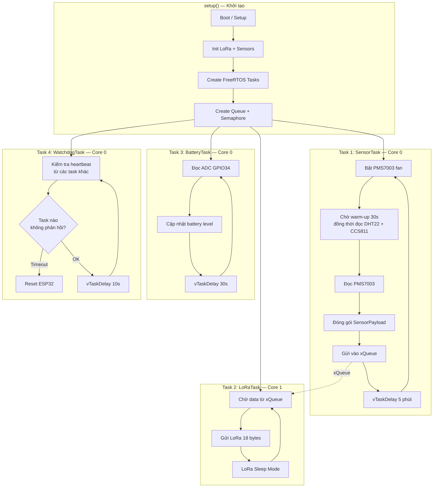

# Sensor Node Firmware — Firmware ESP32 + FreeRTOS

## 1. Tổng quan

Firmware cho sensor node chạy trên **ESP32 DevKit V1** với kiến trúc **FreeRTOS multi-task**, thu thập dữ liệu từ 3 cảm biến (PMS7003, CCS811, DHT22) và gửi qua LoRa mỗi 5 phút.

| Thuộc tính | Giá trị |
|---|---|
| **Platform** | ESP32 (PlatformIO, Arduino framework) |
| **Kiến trúc** | FreeRTOS — 4 task pinned to core |
| **Gói tin LoRa** | 18 bytes `SensorPayload` struct |
| **Chu kỳ gửi** | 5 phút |
| **Nguồn** | Pin 18650 + TP4056 |

---

## 2. Kiến trúc FreeRTOS



### Bảng cấu hình Task

| Task | Core | Priority | Stack | Chu kỳ | Chức năng |
|---|---|---|---|---|---|
| `SensorTask` | 0 | 2 (cao) | 4096 bytes | 5 phút | Đọc tất cả sensor, đóng gói, đẩy vào Queue |
| `LoRaTask` | 1 | 3 (cao nhất) | 2048 bytes | Event-driven | Chờ Queue, gửi LoRa, rồi sleep module |
| `BatteryTask` | 0 | 1 (thấp) | 2048 bytes | 30 giây | Đọc ADC pin, cập nhật biến global |
| `WatchdogTask` | 0 | 0 | 1024 bytes | 10 giây | Giám sát heartbeat, reset nếu treo |

### Giao tiếp giữa các task

| Cơ chế | Giữa | Mục đích |
|---|---|---|
| `xQueueSend/xQueueReceive` | SensorTask → LoRaTask | Truyền `SensorPayload` (18 bytes) |
| `volatile uint8_t` | BatteryTask → SensorTask | Chia sẻ giá trị pin |
| `volatile TickType_t[]` | Tất cả → WatchdogTask | Heartbeat timestamp |

---

## 3. Cấu trúc thư mục

```
firmware/sensor-node/
├── platformio.ini                    # PlatformIO config (6 build environments)
├── include/
│   └── config.h                      # NODE_ID, pins, LoRa params, task config
├── src/
│   ├── main.cpp                      # Setup: init + xTaskCreatePinnedToCore()
│   ├── tasks/
│   │   ├── sensor_task.h/.cpp        # Task đọc PMS7003 + CCS811 + DHT22
│   │   ├── lora_task.h/.cpp          # Task gửi LoRa (chờ Queue)
│   │   ├── battery_task.h/.cpp       # Task giám sát pin
│   │   └── watchdog_task.h/.cpp      # Task watchdog hệ thống
│   ├── drivers/
│   │   ├── pms7003.h/.cpp            # Driver PMS7003 (UART)
│   │   ├── ccs811.h/.cpp             # Driver CCS811 (I2C)
│   │   ├── dht22.h/.cpp              # Driver DHT22 (GPIO)
│   │   ├── lora_radio.h/.cpp         # Driver LoRa AS32-TTL-100 (UART)
│   │   └── battery_adc.h/.cpp        # Driver ADC pin (GPIO34)
│   ├── common/
│   │   ├── packet.h                  # Struct SensorPayload (shared)
│   │   └── debug.h                   # LOG macros
│   └── rtos/
│       └── shared.h                  # Queue, shared variables
└── test/
    ├── test_lora.cpp                 # Test LoRa TX
    ├── test_dht22.cpp                # Test DHT22
    ├── test_ccs811.cpp               # Test CCS811
    ├── test_pms7003.cpp              # Test PMS7003
    └── test_battery.cpp              # Test Battery ADC
```

---

## 4. Pin Mapping (AS32-TTL-100 UART)

| Chân AS32 | GPIO | Lý do |
|---|---|---|
| TXD → RX | **GPIO32** | Serial1 remap (Serial2 đã dùng cho PMS7003) |
| RXD ← TX | **GPIO33** | Serial1 remap |
| MD0 | **GPIO25** | Tránh GPIO4 (DHT22) |
| MD1 | **GPIO26** | Tránh GPIO15 (PMS SET) |
| AUX | **GPIO27** | Free GPIO |

Xem thêm sơ đồ nối dây đầy đủ: [Hardware Assembly Guide](hardware-assembly.md)

---

## 5. Xử lý lỗi

| Tình huống | Xử lý |
|---|---|
| Sensor đọc lỗi (checksum fail) | Retry 3 lần, gửi `0xFFFF` nếu vẫn lỗi |
| PMS7003 UART treo | WatchdogTask phát hiện → reset ESP32 |
| LoRa gửi thất bại | Retry 2 lần, bỏ gói nếu vẫn lỗi |
| Queue đầy (LoRa bận) | Bỏ gói cũ, log warning |
| CCS811 chưa warm-up | Gửi CO₂=0, TVOC=0 trong 20 phút đầu |
| Pin thấp (<10%) | SensorTask tăng interval lên 10–15 phút |

---

## 6. Build & Flash

```bash
# Build firmware chính
pio run -e esp32dev

# Flash + monitor
pio run -e esp32dev -t upload && pio device monitor

# Test từng module riêng
pio run -e test_dht22 -t upload && pio device monitor
pio run -e test_ccs811 -t upload && pio device monitor
pio run -e test_pms7003 -t upload && pio device monitor
pio run -e test_lora -t upload && pio device monitor
pio run -e test_battery -t upload && pio device monitor
```

Xem thêm: [Workflow: Flash Firmware](../../.agents/workflows/flash-firmware.md)
