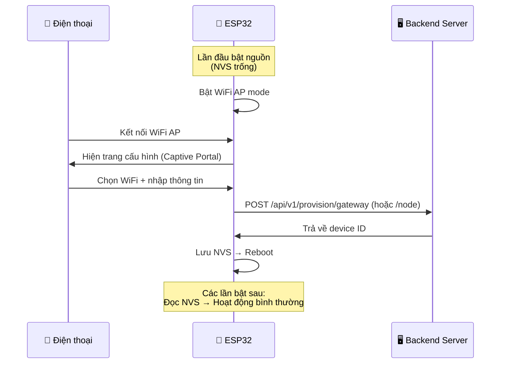

# Hướng dẫn Auto-Provisioning — Cấu hình thiết bị mới

## 1. Tổng quan

Hệ thống **Auto-Provisioning** cho phép thêm Gateway/Sensor Node mới mà **không cần lập trình**, chỉ cần:

1. Cắm nguồn thiết bị (firmware đã flash sẵn)
2. Kết nối WiFi từ điện thoại
3. Điền form trên trình duyệt
4. Hoàn tất → thiết bị tự đăng ký với server và hoạt động

### Kiến trúc



### Thông số cố định trong firmware

| Hằng số | Giá trị | Mô tả |
|---|---|---|
| `SERVER_BASE_URL` | `http://192.168.137.1:3000` | Địa chỉ server |
| `PROVISION_KEY` | `airquality2026` | Mã xác thực thiết bị |
| `GATEWAY_SECRET` | `super-secret-key` | Mã xác thực telemetry (chỉ Gateway) |

> [!NOTE]
> Khi mua tên miền, chỉ cần sửa `SERVER_BASE_URL` trong `config.h` rồi flash lại firmware.

---

## 2. Thêm Gateway mới

### Yêu cầu

- ESP32 đã flash firmware gateway
- Server backend đang chạy
- Mạng WiFi có kết nối đến server

### Các bước

**Bước 1:** Cắm nguồn ESP32 Gateway → LED nhấp nháy nhanh (2Hz) = chế độ cấu hình

**Bước 2:** Trên điện thoại, kết nối WiFi: **`AirQuality-GW-Setup`** (không mật khẩu)

**Bước 3:** Trình duyệt tự mở trang cấu hình (hoặc mở `http://192.168.4.1`):

- **Bước 1/2 — WiFi:** Nhấn "Quét WiFi" → chọn mạng WiFi → nhập mật khẩu
- **Bước 2/2 — Tên:** Nhập tên gateway (VD: "Gateway Tầng 3") và mô tả vị trí

**Bước 4:** Nhấn **"✅ Cài đặt"** → ESP32 sẽ:

1. Kết nối WiFi đã chọn
2. Gọi API đăng ký với server (`POST /api/v1/provision/gateway`)
3. Nhận Gateway ID (VD: `GW_004`)
4. Lưu vào NVS → Reboot tự động
5. LED sáng ổn định = hoạt động bình thường

### Dữ liệu lưu trong NVS (Gateway)

| Key | Ví dụ | Mô tả |
|---|---|---|
| `gateway_id` | `GW_004` | ID tự động từ server |
| `wifi_ssid` | `MyWiFi` | WiFi đã chọn |
| `wifi_pass` | `********` | Mật khẩu WiFi |
| `server_base` | `http://192.168.137.1:3000` | URL server |
| `prov_key` | `airquality2026` | Provision key |

---

## 3. Thêm Sensor Node mới

### Yêu cầu

- ESP32 đã flash firmware sensor-node
- **Ít nhất 1 Gateway** đã đăng ký trên server
- Mạng WiFi tạm (chỉ dùng trong lúc cấu hình, sau đó node chỉ dùng LoRa)

### Các bước

**Bước 1:** Bật nguồn ESP32 Sensor Node → LED nhấp nháy nhanh (4Hz) = chế độ cấu hình

**Bước 2:** Trên điện thoại, kết nối WiFi: **`AirQuality-Node-Setup`** (không mật khẩu)

**Bước 3:** Trình duyệt tự mở trang cấu hình (hoặc mở `http://192.168.4.1`):

- **Bước 1/2 — WiFi:** Quét WiFi → chọn mạng → nhập mật khẩu → nhấn "Tải danh sách Gateway"
- **Bước 2/2 — Gateway + Tên:** Chọn Gateway gần nhất từ danh sách → nhập tên node → (tuỳ chọn) nhập toạ độ GPS

**Bước 4:** Nhấn **"✅ Cài đặt"** → ESP32 sẽ:

1. Gọi API đăng ký (`POST /api/v1/provision/node`)
2. Nhận Node ID (VD: `NODE_005`) + numeric ID (VD: `0x05`)
3. Lưu vào NVS → **TẮT WiFi hoàn toàn** → Reboot
4. Hoạt động chế độ LoRa-only (gửi dữ liệu qua LoRa đến Gateway)

### Dữ liệu lưu trong NVS (Sensor Node)

| Key | Ví dụ | Mô tả |
|---|---|---|
| `node_id` | `0x05` | Numeric ID cho SensorPayload (1 byte) |
| `node_id_str` | `NODE_005` | String ID |
| `gateway_id` | `GW_003` | Gateway mà node thuộc về |

> [!IMPORTANT]
> Sensor Node **không lưu WiFi** vì sau provisioning WiFi bị tắt vĩnh viễn. Node chỉ giao tiếp qua LoRa.

---

## 4. Factory Reset

Nếu cần **xoá cấu hình** và quay lại chế độ provisioning:

1. **Giữ nút BOOT (GPIO0)** trên ESP32 DevKit trong **5 giây**
2. LED nhấp nháy nhanh xác nhận
3. ESP32 tự khởi động lại vào chế độ Captive Portal
4. Thực hiện lại quy trình cấu hình như mới

| Thông số | Giá trị |
|---|---|
| Nút | BOOT (GPIO0) trên ESP32 DevKit V1 |
| Thời gian giữ | 5 giây |
| Namespace xoá | `gw_config` (Gateway) hoặc `node_config` (Sensor Node) |

> [!WARNING]
> Factory reset sẽ xoá toàn bộ cấu hình (WiFi, ID, server). Thiết bị cần được cấu hình lại từ đầu.

---

## 5. Provisioning API Reference

Base URL: `http://192.168.137.1:3000`

### `POST /api/v1/provision/gateway`

Gateway tự đăng ký với server.

**Headers:** `Content-Type: application/json`

**Request Body:**
```json
{
  "provision_key": "airquality2026",
  "name": "Gateway Tầng 3",
  "location_desc": "Gần cầu thang B"
}
```

**Response (201):**
```json
{
  "success": true,
  "data": {
    "id": "GW_004",
    "name": "Gateway Tầng 3",
    "status": "online",
    "location_desc": "Gần cầu thang B"
  }
}
```

---

### `GET /api/v1/provision/gateways`

Lấy danh sách gateway (để sensor node chọn).

**Query Parameters:**

| Param | Kiểu | Bắt buộc | Mô tả |
|---|---|---|---|
| `provision_key` | string | ✅ | Mã xác thực |

**Response (200):**
```json
{
  "success": true,
  "data": [
    {
      "id": "GW_001",
      "name": "Gateway Tầng 1",
      "status": "online",
      "location_desc": "Sảnh chính"
    }
  ]
}
```

---

### `POST /api/v1/provision/node`

Sensor node tự đăng ký dưới 1 gateway.

**Request Body:**
```json
{
  "provision_key": "airquality2026",
  "name": "Phòng họp 302",
  "gateway_id": "GW_003",
  "lat": 10.7733,
  "lng": 106.6575
}
```

**Response (201):**
```json
{
  "success": true,
  "data": {
    "id": "NODE_005",
    "name": "Phòng họp 302",
    "gateway_id": "GW_003",
    "status": "active",
    "node_numeric_id": 5
  }
}
```

> [!NOTE]
> `node_numeric_id` là giá trị 1-byte (1-255) dùng trong `SensorPayload.nodeId` truyền qua LoRa.

---

## 6. Cấu trúc source code

### Backend

```
backend/src/
├── routes/
│   └── provisionApi.js          # Route definitions (3 endpoints)
├── controllers/
│   └── provisionController.js   # Business logic
└── validations/
    └── provisionValidation.js   # Verify provision_key + validate body
```

### Gateway Firmware

```
firmware/gateway/src/
├── core/
│   └── nvs_config.h/.cpp       # Đọc/ghi NVS (gateway_id, wifi, server)
└── provisioning/
    ├── captive_portal.h/.cpp    # WiFi AP + DNS + WebServer
    └── portal_html.h            # Embedded HTML (2 bước)
```

### Sensor Node Firmware

```
firmware/sensor-node/src/
├── core/
│   └── nvs_config.h/.cpp       # Đọc/ghi NVS (node_id, gateway_id)
└── provisioning/
    ├── captive_portal.h/.cpp    # WiFi AP + fetch gateways + register
    └── portal_html.h            # Embedded HTML (2 bước)
```

---

## 7. Troubleshooting

| Vấn đề | Nguyên nhân | Giải pháp |
|---|---|---|
| Không thấy WiFi AP | ESP32 đã provisioned | Factory reset (giữ BOOT 5s) |
| Captive Portal không tự mở | Tuỳ thuộc điện thoại | Mở trình duyệt → `http://192.168.4.1` |
| "Không kết nối được WiFi" | Sai mật khẩu hoặc WiFi quá xa | Kiểm tra mật khẩu, đưa ESP gần router |
| "Server trả lỗi" | Server không chạy | Kiểm tra `npm run dev` trên server |
| "Chưa có gateway nào" (Sensor Node) | Chưa đăng ký gateway trước | Thêm gateway trước rồi mới thêm node |
| Nút BOOT không reset | Giữ chưa đủ 5 giây | Giữ chắc 5 giây, chờ LED nhấp nháy |
