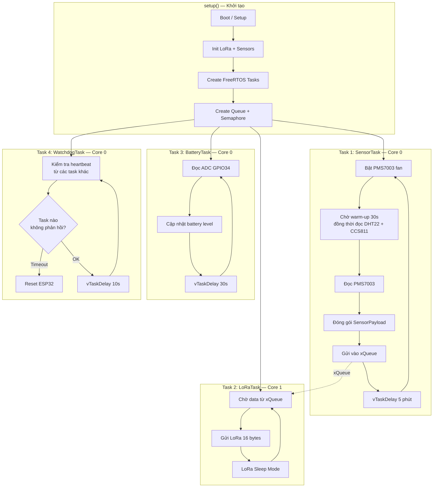
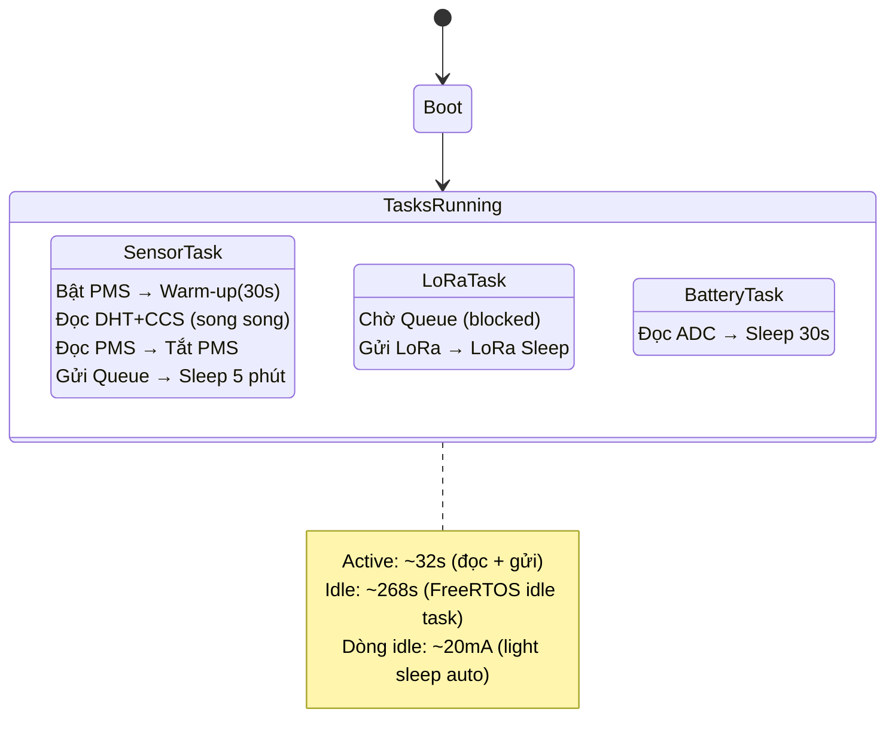

# Đánh giá thiết kế gói tin LoRa & Kế hoạch Firmware Sensor Node

## 1. Đánh giá thiết kế gói tin LoRa hiện tại


### 1.1. Tổng quan

| Thuộc tính | Giá trị |
|---|---|
| **Tổng kích thước** | 16 bytes |
| **Payload tối đa SX1278** | 255 bytes |
| **Tỷ lệ sử dụng** | 6.3% (rất tối ưu) |
| **Số trường dữ liệu** | 10 |

### 1.2. Phân tích từng trường

| Trường | Kích thước | Kiểu dữ liệu | Dải giá trị | Đánh giá |
|---|---|---|---|---|
| Node ID | 1 byte | `uint8_t` | 0–255 | ✅ Hỗ trợ 255 node, đủ cho quy mô dự án |
| Pkt Type | 1 byte | `uint8_t` | 0x00–0xFF | ✅ Cho phép mở rộng nhiều loại gói tin |
| Msg ID | 1 byte | `uint8_t` | 0–255 | ✅ Phát hiện packet loss, wrap-around mỗi 256 gói |
| PM2.5 | 2 bytes | `uint16_t` | 0–6553.5 µg/m³ | ✅ Dải đo PMS7003 (0–500), dư sức chứa |
| PM10 | 2 bytes | `uint16_t` | 0–6553.5 µg/m³ | ✅ Tương tự PM2.5 |
| CO2 | 2 bytes | `uint16_t` | 0–65535 ppm | ✅ Dải đo CCS811 (400–8192ppm) → phù hợp |
| TVOC | 2 bytes | `uint16_t` | 0–65535 ppb | ✅ Dải đo CCS811 (0–1187ppb) → phù hợp |
| Temperature | 2 bytes | `int16_t` | -3276.8–3276.7 °C | ✅ Dùng `int16_t` (có dấu) cho nhiệt độ âm - rất tốt |
| Humidity | 2 bytes | `uint16_t` | 0–6553.5 % | ✅ ×10 giữ 1 chữ số thập phân, DHT22 (0–100%) phù hợp |
| Battery | 1 byte | `uint8_t` | 0–100% | ✅ Đủ cho phần trăm pin |

### 1.3. Điểm mạnh

1. **Kích thước tối ưu (16 bytes)**: Gói tin rất gọn, giảm Time-on-Air → tiết kiệm pin, giảm xung đột trên kênh truyền
2. **Dùng `__attribute__((packed))`**: Tránh padding → đảm bảo struct size chính xác 16 bytes
3. **Mã hóa thập phân (×10)**: Tiết kiệm không gian (2 bytes thay vì 4 bytes cho float), độ chính xác 0.1 phù hợp nhu cầu
4. **Msg ID cho packet loss detection**: Cơ chế counter wrap-around 0–255 đơn giản và hiệu quả
5. **Pkt Type mở rộng**: Cho phép phân biệt Data (0x01), Heartbeat (0x02), ACK... trong tương lai
6. **Tương thích Database**: Các trường khớp 1:1 với bảng `measurements` trong PostgreSQL schema

### 1.4. Điểm cần lưu ý / Cải thiện tiềm năng

> [!WARNING]
> Các điểm dưới đây là **gợi ý tùy chọn nâng cao**, KHÔNG bắt buộc phải thay đổi cho phiên bản đầu tiên.

| # | Vấn đề | Mức độ | Giải pháp gợi ý |
|---|---|---|---|
| 1 | **Không có CRC/Checksum riêng** ở tầng ứng dụng | Thấp | LoRa SX1278 đã có CRC ở tầng PHY, nên chấp nhận được. Có thể thêm 1 byte CRC8 nếu muốn phát hiện lỗi bộ nhớ |
| 2 | **Không có Timestamp** trong gói tin | Thấp | Gateway sẽ gán timestamp ngay lúc nhận → hợp lý. Chỉ lệch vài mili-giây |
| 3 | **Node ID giới hạn 255** | Thấp | Đủ cho quy mô dự án (3 node), nếu cần mở rộng hàng ngàn thì dùng 2 bytes |
| 4 | **Msg ID wrap-around** nhanh (256 gói) | Thấp | Nếu gửi mỗi 5 phút → wrap mỗi ~21 giờ. Gateway cần logic theo dõi theo từng node |
| 5 | **Thiếu trường error flags** | Trung bình | Có thể tận dụng Pkt Type hoặc thêm 1 byte status flags báo sensor bị lỗi |

### 1.5. Kết luận đánh giá

> [!IMPORTANT]
> **Thiết kế gói tin LoRa hiện tại rất tốt** cho phiên bản triển khai đầu tiên. Kích thước 16 bytes tối ưu, cấu trúc rõ ràng, có cơ chế phát hiện mất gói, tương thích hoàn toàn với phần cứng (PMS7003, CCS811, DHT22) và database schema. **Khuyến nghị giữ nguyên thiết kế này và triển khai firmware.**

---

## 2. Phân tích: Có nên sử dụng FreeRTOS?

### 2.1. Bối cảnh: ESP32 đã có sẵn FreeRTOS

> [!IMPORTANT]
> ESP32 Arduino framework **chạy trên nền FreeRTOS** sẵn rồi. Hàm `setup()` và `loop()` thực chất là một FreeRTOS task. Câu hỏi không phải là "thêm RTOS vào" mà là **có nên tách thành nhiều task song song không**.

### 2.2. So sánh: Sequential Loop vs FreeRTOS Multi-Task

| Tiêu chí | Sequential Loop (không tách task) | FreeRTOS Multi-Task (tách task) |
|---|---|---|
| **Độ phức tạp code** | ⭐ Đơn giản, dễ debug | ⬆️ Phức tạp hơn (semaphore, queue) |
| **Thời gian thức** | ❌ ~35s (warm-up 30s + đọc tuần tự 5s) | ✅ ~32s (warm-up song song với đọc CCS/DHT) |
| **Xử lý sensor treo** | ❌ Toàn bộ firmware bị block | ✅ Chỉ task đó bị treo, WDT riêng sẽ reset |
| **Quản lý năng lượng** | ⬆️ Dễ vào Deep Sleep | ⚠️ Cần đồng bộ tất cả task trước khi sleep |
| **Mở rộng tương lai** | ❌ Thêm tính năng = thêm blocking | ✅ Thêm task mới dễ dàng |
| **Phù hợp đồ án** | Phù hợp MVP nhanh | ✅ **Chuyên nghiệp hơn cho báo cáo luận văn** |

### 2.3. Các lợi ích cụ thể khi dùng FreeRTOS cho dự án này

#### ① Song song hóa warm-up — Tiết kiệm ~3-5 giây mỗi chu kỳ

```
Sequential:  |--PMS warm-up 30s--|--Read DHT 1s--|--Read CCS 1s--|--Read PMS--|--Send LoRa--|
             Tổng: ~35s

FreeRTOS:    |--PMS warm-up 30s--|-Read PMS-|
             |--Read DHT+CCS 2s--|   (idle)    |--Send LoRa--|
             Tổng: ~32s (DHT/CCS chạy song song với PMS warm-up)
```

#### ② Watchdog riêng cho từng task

Nếu PMS7003 bị treo (UART không phản hồi), chỉ task sensor bị reset, task LoRa và battery vẫn hoạt động bình thường.

#### ③ Kiến trúc chuyên nghiệp cho báo cáo luận văn

FreeRTOS cho thấy kiến thức về hệ thống nhúng nâng cao — điểm cộng lớn khi bảo vệ đồ án.

### 2.4. Kết luận

> [!IMPORTANT]
> **Khuyến nghị: SỬ DỤNG FreeRTOS** nhưng ở mức **vừa phải** (3-4 task). Không cần phức tạp hóa quá mức — tận dụng đúng thế mạnh song song hóa và watchdog cô lập, giữ code dễ hiểu.

---

## 3. Kế hoạch thiết kế Firmware Sensor Node (FreeRTOS)

### 3.1. Tổng quan kiến trúc FreeRTOS



### 3.2. Thiết kế chi tiết các FreeRTOS Task

| Task | Core | Priority | Stack | Chu kỳ | Chức năng |
|---|---|---|---|---|---|
| `SensorTask` | 0 | 2 (cao) | 4096 bytes | 5 phút | Đọc tất cả sensor, đóng gói, đẩy vào Queue |
| `LoRaTask` | 1 | 3 (cao nhất) | 2048 bytes | Event-driven | Chờ Queue, gửi LoRa, rồi sleep module |
| `BatteryTask` | 0 | 1 (thấp) | 2048 bytes | 30 giây | Đọc ADC pin, cập nhật biến global |
| `WatchdogTask` | 0 | 0 (thấp nhất) | 1024 bytes | 10 giây | Giám sát heartbeat, reset nếu treo |

**Cơ chế giao tiếp giữa các task:**

| Cơ chế | Giữa | Mục đích |
|---|---|---|
| `xQueueSend / xQueueReceive` | SensorTask → LoRaTask | Truyền `SensorPayload` (16 bytes) |
| `volatile uint8_t batteryLevel` | BatteryTask → SensorTask | Chia sẻ giá trị pin (atomic, 1 byte nên không cần mutex) |
| `volatile TickType_t lastHeartbeat[]` | Tất cả → WatchdogTask | Mỗi task ghi timestamp hoạt động cuối |

### 3.3. Cấu trúc thư mục firmware (PlatformIO + FreeRTOS)

```
firmware/sensor-node/
├── platformio.ini
├── include/
│   └── config.h                # NODE_ID, pins, LoRa params, task priorities, intervals
├── src/
│   ├── main.cpp                # setup(): init + xTaskCreatePinnedToCore(), loop() trống
│   ├── tasks/
│   │   ├── sensor_task.h/.cpp  # [NEW] Task đọc PMS7003 + CCS811 + DHT22
│   │   ├── lora_task.h/.cpp    # [NEW] Task gửi LoRa (chờ Queue)
│   │   ├── battery_task.h/.cpp # [NEW] Task giám sát pin
│   │   └── watchdog_task.h/.cpp# [NEW] Task watchdog hệ thống
│   ├── drivers/
│   │   ├── pms7003.h/.cpp      # Driver PMS7003 (UART2)
│   │   ├── ccs811.h/.cpp       # Driver CCS811 (I2C)
│   │   ├── dht22.h/.cpp        # Driver DHT22 (GPIO4)
│   │   ├── lora_radio.h/.cpp   # Driver LoRa SX1278 (SPI)
│   │   └── battery_adc.h/.cpp  # Driver ADC pin (GPIO34)
│   ├── common/
│   │   ├── packet.h            # Struct SensorPayload (shared)
│   │   └── debug.h             # Log macros
│   └── rtos/
│       └── shared.h            # [NEW] Khai báo Queue, Semaphore, shared variables
└── test/
```

> [!NOTE]
> So với bản cũ: tách riêng `drivers/` (code giao tiếp phần cứng thuần) và `tasks/` (logic FreeRTOS task). Mỗi driver không biết về RTOS, mỗi task gọi driver.

### 3.4. Config mở rộng cho FreeRTOS

```cpp
// ===== config.h (thêm phần RTOS) =====

// ... (giữ nguyên phần NODE_ID, LoRa, Pin Assignment từ bản cũ) ...

// ===== FreeRTOS Task Config =====
#define SENSOR_TASK_STACK     4096
#define SENSOR_TASK_PRIORITY  2
#define SENSOR_TASK_CORE      0

#define LORA_TASK_STACK       2048
#define LORA_TASK_PRIORITY    3       // Cao nhất — gửi xong càng sớm càng tốt
#define LORA_TASK_CORE        1       // Core riêng để không bị sensor block

#define BATTERY_TASK_STACK    2048
#define BATTERY_TASK_PRIORITY 1
#define BATTERY_TASK_CORE     0

#define WDT_TASK_STACK        1024
#define WDT_TASK_PRIORITY     0
#define WDT_TASK_CORE         0

#define DATA_QUEUE_SIZE       3       // Buffer 3 gói nếu LoRa bận
#define WDT_TIMEOUT_MS        60000   // 60s không heartbeat → reset
```

### 3.5. Pseudocode `main.cpp` (FreeRTOS)

```cpp
#include <Arduino.h>
#include "config.h"
#include "common/packet.h"
#include "rtos/shared.h"
#include "tasks/sensor_task.h"
#include "tasks/lora_task.h"
#include "tasks/battery_task.h"
#include "tasks/watchdog_task.h"
#include "drivers/lora_radio.h"
#include "drivers/pms7003.h"
#include "drivers/ccs811.h"
#include "drivers/dht22.h"
#include "drivers/battery_adc.h"

// ===== FreeRTOS Shared Resources =====
QueueHandle_t     dataQueue;
volatile uint8_t  batteryLevel = 0;
volatile TickType_t taskHeartbeat[4] = {0};  // Heartbeat cho WDT

// ===== RTC Memory (survive deep sleep) =====
RTC_DATA_ATTR uint8_t msgCounter = 0;

void setup() {
    Serial.begin(115200);
    Serial.println("========================================");
    Serial.println("  AIR QUALITY SENSOR NODE (FreeRTOS)");
    Serial.printf("  Node ID: 0x%02X\n", NODE_ID);
    Serial.println("========================================");

    // 1. Init drivers
    initLoRa();
    initPMS7003();
    initCCS811();
    initDHT22();
    initBatteryADC();

    // 2. Create Queue (16 bytes × 3 slots)
    dataQueue = xQueueCreate(DATA_QUEUE_SIZE, sizeof(SensorPayload));

    // 3. Create Tasks (pinned to core)
    xTaskCreatePinnedToCore(sensorTask,  "Sensor",  SENSOR_TASK_STACK,
                            NULL, SENSOR_TASK_PRIORITY,  NULL, SENSOR_TASK_CORE);
    xTaskCreatePinnedToCore(loraTask,    "LoRa",    LORA_TASK_STACK,
                            NULL, LORA_TASK_PRIORITY,    NULL, LORA_TASK_CORE);
    xTaskCreatePinnedToCore(batteryTask, "Battery", BATTERY_TASK_STACK,
                            NULL, BATTERY_TASK_PRIORITY, NULL, BATTERY_TASK_CORE);
    xTaskCreatePinnedToCore(watchdogTask,"WDT",     WDT_TASK_STACK,
                            NULL, WDT_TASK_PRIORITY,     NULL, WDT_TASK_CORE);
}

void loop() {
    // Trống — tất cả logic nằm trong FreeRTOS tasks
    vTaskDelete(NULL);  // Xóa loop task để giải phóng stack
}
```

### 3.6. Pseudocode `SensorTask` (đọc song song)

```cpp
void sensorTask(void* parameter) {
    SensorPayload payload;

    while (true) {
        taskHeartbeat[0] = xTaskGetTickCount();  // Báo WDT mình còn sống

        // --- Giai đoạn 1: Bật PMS7003 warm-up + đọc DHT/CCS song song ---
        pms7003_powerOn();                        // Bật quạt PMS
        
        // Trong khi PMS warm-up 30s, đọc DHT22 + CCS811 (chỉ mất ~2s)
        readDHT22(&payload);
        setCCS811EnvData(payload.temperature, payload.humidity);
        readCCS811(&payload);
        
        // Chờ PMS7003 warm-up xong (trừ đi thời gian đã đọc DHT/CCS)
        vTaskDelay(pdMS_TO_TICKS(PMS_WARMUP_MS - 2000));

        // --- Giai đoạn 2: Đọc PMS7003 data ---
        readPMS7003(&payload);
        pms7003_powerOff();                       // Tắt quạt tiết kiệm pin

        // --- Giai đoạn 3: Đóng gói header ---
        payload.nodeId  = NODE_ID;
        payload.pktType = PKT_TYPE_DATA;
        payload.msgId   = msgCounter++;
        payload.battery = batteryLevel;           // Lấy từ BatteryTask

        // --- Giai đoạn 4: Gửi vào Queue cho LoRaTask ---
        if (xQueueSend(dataQueue, &payload, pdMS_TO_TICKS(1000)) != pdTRUE) {
            Serial.println("[WARN] Queue đầy, bỏ gói tin này");
        }

        // --- Giai đoạn 5: Ngủ 5 phút ---
        vTaskDelay(pdMS_TO_TICKS(SEND_INTERVAL_MS - PMS_WARMUP_MS));
    }
}
```

### 3.7. Pseudocode `LoRaTask`

```cpp
void loraTask(void* parameter) {
    SensorPayload rxPayload;

    while (true) {
        taskHeartbeat[1] = xTaskGetTickCount();

        // Block chờ data từ Queue (timeout 10 phút → nếu không có thì gửi heartbeat)
        if (xQueueReceive(dataQueue, &rxPayload, pdMS_TO_TICKS(600000)) == pdTRUE) {
            // Gửi data packet
            sendLoRaPacket(&rxPayload);
            Serial.printf("[TX] MsgID:%d PM2.5:%.1f CO2:%d Bat:%d%%\n",
                rxPayload.msgId, rxPayload.pm25/10.0, rxPayload.co2, rxPayload.battery);
        } else {
            // Timeout → gửi heartbeat để Gateway biết node còn sống
            SensorPayload hb = {0};
            hb.nodeId  = NODE_ID;
            hb.pktType = PKT_TYPE_HEARTBEAT;
            hb.battery = batteryLevel;
            sendLoRaPacket(&hb);
            Serial.println("[TX] Heartbeat sent");
        }

        // Đưa LoRa module vào sleep mode
        loraModuleSleep();
    }
}
```

### 3.8. Thư viện sử dụng (PlatformIO)

| Thư viện | Mục đích | PlatformIO ID |
|---|---|---|
| `LoRa` (Sandeep Mistry) | Giao tiếp SX1278 qua SPI | `sandeepmistry/LoRa` |
| `PMS Library` | Đọc PMS7003 qua UART | `fu-hsi/PMS Library` |
| `Adafruit CCS811` | Đọc CCS811 qua I2C | `adafruit/Adafruit CCS811 Library` |
| `DHT sensor library` | Đọc DHT22 | `adafruit/DHT sensor library` |
| *FreeRTOS* | *Tích hợp sẵn trong ESP32 Arduino* | *Không cần thêm* |

### 3.9. Quản lý năng lượng (Power Management)



> [!TIP]
> **Với FreeRTOS, khi tất cả task đều đang `vTaskDelay`, ESP32 tự động vào Light Sleep** (nếu cấu hình `esp_pm_configure`) — giảm dòng từ ~80mA xuống ~20mA mà không cần code Deep Sleep phức tạp. Với Deep Sleep thì cần đồng bộ tất cả task, phức tạp hơn nhiều.

### 3.10. Xử lý lỗi & Độ tin cậy (FreeRTOS)

| Tình huống | Xử lý |
|---|---|
| Sensor đọc lỗi (checksum fail) | Retry 3 lần trong SensorTask, gửi `0xFFFF` nếu vẫn lỗi |
| PMS7003 UART treo | WatchdogTask phát hiện SensorTask không heartbeat → reset ESP32 |
| LoRa gửi thất bại | LoRaTask retry 2 lần, nếu vẫn thất bại → bỏ gói, chờ gói tiếp |
| Queue đầy (LoRa bận) | SensorTask bỏ gói cũ, log warning |
| CCS811 chưa warm-up | Gửi CO2=0, TVOC=0 trong 20 phút đầu |
| Pin thấp (<10%) | SensorTask tăng interval lên 10-15 phút |
| Một task crash | WatchdogTask phát hiện + `esp_restart()` toàn bộ |

### 3.11. Các bước triển khai (Roadmap - cập nhật)

| Bước | Nội dung | Ước lượng |
|---|---|---|
| 1 | Tạo project PlatformIO, cấu hình `platformio.ini` | 30 phút |
| 2 | Viết `config.h` + `packet.h` + `shared.h` | 30 phút |
| 3 | Viết driver PMS7003 (thuần, không RTOS) | 2 giờ |
| 4 | Viết driver CCS811 (thuần, không RTOS) | 2 giờ |
| 5 | Viết driver DHT22 + Battery ADC | 1.5 giờ |
| 6 | Viết driver LoRa radio | 1.5 giờ |
| 7 | Viết `sensor_task.cpp` + `lora_task.cpp` (Queue) | 2 giờ |
| 8 | Viết `battery_task.cpp` + `watchdog_task.cpp` | 1.5 giờ |
| 9 | Tích hợp `main.cpp` (tạo task, test) | 2 giờ |
| 10 | Thêm Light Sleep + Power Management | 1.5 giờ |
| 11 | Test thực tế với Gateway nhận dữ liệu | 2 giờ |
| **Tổng** | | **~17 giờ** |

> [!NOTE]
> Tăng ~2.5 giờ so với bản sequential, chủ yếu do viết thêm FreeRTOS task wrappers, shared resources, và watchdog.
