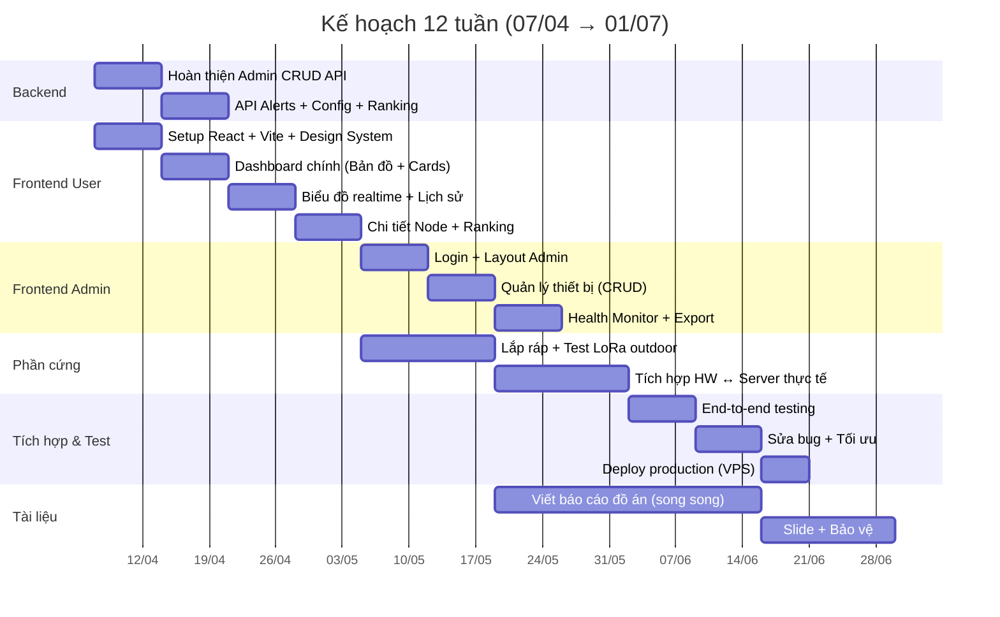

# Timeline — Kế hoạch 12 tuần (07/04 → 01/07/2026)

> **Thời gian tổng thể**: 23/02/2026 → 01/07/2026 (~18 tuần)  
> **Đã thực hiện**: 23/02 → 07/04 (~6 tuần)  
> **Còn lại**: 07/04 → 01/07 (**12 tuần**)

---

## Tổng quan Gantt

---

## Chi tiết từng tuần

| Tuần | Ngày | Trọng tâm | Deliverable |
|---|---|---|---|
| 1 | 07–13/04 | Backend CRUD API + Frontend Setup | API CRUD, skeleton React app |
| 2 | 14–20/04 | Dashboard User (bản đồ, cards, realtime) | Dashboard hiển thị dữ liệu |
| 3 | 21–27/04 | Biểu đồ lịch sử + Chi tiết Node | User flows hoàn chỉnh |
| 4 | 28/04–04/05 | Admin Login + Dashboard Admin | Admin login, dashboard cơ bản |
| 5 | 05–11/05 | Admin CRUD thiết bị + Test HW | CRUD hoạt động, HW build thành công |
| 6 | 12–18/05 | Health Monitor + Test LoRa outdoor | Admin đầy đủ, kết quả test LoRa |
| 7 | 19–25/05 | **Tích hợp HW ↔ Server** + Bắt đầu báo cáo | Pipeline end-to-end hoạt động |
| 8 | 26/05–01/06 | Testing + Sửa bug | Hệ thống chạy ổn định 24-48h |
| 9 | 02–08/06 | Deploy + Thu dữ liệu thực tế | Có dữ liệu thật trên production |
| 10 | 09–15/06 | Hoàn thiện báo cáo | Draft hoàn chỉnh |
| 11 | 16–22/06 | Slide + Demo | Slide + video demo hoàn chỉnh |
| 12 | 23/06–01/07 | **Bảo vệ đồ án** | ✅ |

---

## Ưu tiên theo giai đoạn

| Giai đoạn | Tuần | Trọng tâm | Mức ưu tiên |
|---|---|---|---|
| GĐ 1: Backend + Frontend | 1–3 | Frontend User từ 0, bổ sung API | 🔴 Rất cao |
| GĐ 2: Admin + Hardware | 4–6 | Frontend Admin + Test phần cứng | 🔴 Rất cao |
| GĐ 3: Tích hợp | 7–8 | End-to-end pipeline + Testing | 🔴 Rất cao |
| GĐ 4: Deploy + Dữ liệu | 9–10 | Production + Real data | 🟡 Cao |
| GĐ 5: Tài liệu + Bảo vệ | 10–12 | Báo cáo + Slide + Bảo vệ | 🟡 Cao |

---

## Tính năng có thể bỏ nếu thiếu thời gian

> [!WARNING]
> Ưu tiên bỏ theo thứ tự (ít quan trọng nhất trước):

1. ~~Quản lý tài khoản~~ → Dùng 1 admin cố định
2. ~~Push Notification/Email~~ → Chỉ hiển thị trên Dashboard
3. ~~Log hệ thống (Audit trail)~~ → Log console
4. ~~Responsive mobile hoàn hảo~~ → Desktop-first
5. ~~Xếp hạng ô nhiễm~~ → Nice-to-have
