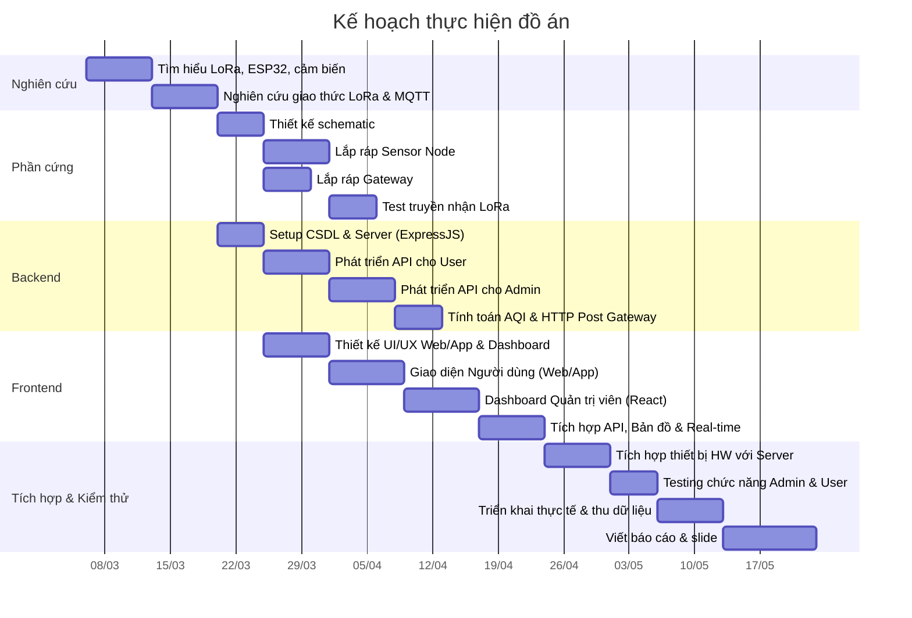

# 🌍 Hệ thống giám sát chất lượng không khí đô thị sử dụng mạng LoRa

## 1. Tổng quan đề tài

| Mục | Chi tiết |
|---|---|
| **Tên đề tài** | Hệ thống giám sát chất lượng không khí đô thị sử dụng mạng cảm biến không dây LoRa |
| **Công nghệ chính** | ESP32, LoRa (SX1278/SX1276), Cảm biến bụi mịn PMS7003, Cảm biến khí CCS811 (CO₂/TVOC) |
| **Mục tiêu** | Xây dựng mạng cảm biến phân tán đo bụi mịn (PM2.5/PM10) và khí độc (CO₂/TVOC), truyền dữ liệu qua LoRa về gateway, hiển thị trên dashboard web thời gian thực |

---

## 2. Kiến trúc hệ thống

```
┌─────────────┐    LoRa 433/868MHz    ┌──────────────┐    WiFi/4G    ┌──────────────┐
│  Sensor Node │ ──────────────────▶  │   Gateway    │ ───────────▶ │  Cloud Server │
│  (ESP32 +    │                      │  (ESP32 +    │              │  (VPS/Cloud)  │
│   LoRa +     │                      │   LoRa +     │              │               │
│   PMS7003 +  │                      │   WiFi)      │              │  ┌──────────┐ │
│   CCS811)    │                      │              │              │               │
└─────────────┘                       └──────────────┘              │  │ Database │ │
                                                                     │  │ (MySQL/  │ │
┌─────────────┐    LoRa                                             │  │ InfluxDB)│ │
│  Sensor Node │ ──────────────────▶  (cùng Gateway)                │  └──────────┘ │
│  #2          │                                                     │  ┌──────────┐ │
└─────────────┘                                                     │  │ Web App  │ │
                                                                     │  │(Dashboard)││
┌─────────────┐    LoRa                                             │  └──────────┘ │
│  Sensor Node │ ──────────────────▶  (cùng Gateway)                └──────────────┘
│  #3          │                                                          │
└─────────────┘                                                          ▼
                                                                    ┌──────────┐
                                                                    │  Người   │
                                                                    │  dùng    │
                                                                    │ (Web/App)│
                                                                    └──────────┘
```

---

## 3. Phân chia module & Kế hoạch thực hiện

### 📦 Module 1: Sensor Node (Node cảm biến)

| Hạng mục | Chi tiết |
|---|---|
| **Phần cứng** | ESP32 + Module LoRa SX1278 + PMS7003 (bụi mịn) + CCS811 (CO₂/TVOC) + DHT22 (nhiệt độ/độ ẩm) |
| **Nguồn điện** | Pin Li-Ion 18650 + Module sạc TP4056 (hoặc solar panel 6V) |
| **Chức năng** | Đọc dữ liệu PM2.5, PM10, CO₂, TVOC, nhiệt độ, độ ẩm → Đóng gói → Gửi qua LoRa |
| **Chế độ tiết kiệm** | Deep sleep giữa các lần đo (ví dụ: đo 1 lần/5 phút) |

**Sơ đồ kết nối cảm biến:**
```
ESP32 GPIO16 (RX2) ◄──── PMS7003 TX   (UART)
ESP32 GPIO17 (TX2) ────► PMS7003 RX
ESP32 GPIO21 (SDA) ◄───► CCS811 SDA    (I2C, addr 0x5A)
ESP32 GPIO22 (SCL) ◄───► CCS811 SCL
ESP32 GPIO4        ◄──── DHT22 DATA    (1-Wire)
ESP32 VSPI (18,19,23,5) ◄───► LoRa SX1278 (SPI)
```

**Công việc cần làm:**
- [ ] Thiết kế schematic mạch điện (Fritzing/KiCad)
- [ ] Lập trình firmware ESP32 (Arduino/PlatformIO)
  - [ ] Đọc dữ liệu từ PMS7003 qua UART (PM2.5, PM10)
  - [ ] Đọc dữ liệu từ CCS811 qua I2C (CO₂ ppm, TVOC ppb)
  - [ ] Đọc dữ liệu từ DHT22 (nhiệt độ, độ ẩm)
  - [ ] Bù nhiệt độ/độ ẩm cho CCS811 (setEnvironmentalData)
  - [ ] Đóng gói dữ liệu thành packet LoRa (14 bytes)
  - [ ] Gửi packet qua LoRa (thư viện RadioLib hoặc LoRa.h)
  - [ ] Cấu hình Deep Sleep để tiết kiệm pin
- [ ] Thiết kế vỏ hộp bảo vệ (3D print hoặc hộp nhựa)

---

### 📦 Module 2: LoRa Gateway

| Hạng mục | Chi tiết |
|---|---|
| **Phần cứng** | ESP32 + Module LoRa SX1278 + WiFi (built-in ESP32) |
| **Nguồn điện** | Adapter 5V (lắp cố định) |
| **Chức năng** | Nhận packet LoRa → Parse dữ liệu → Gửi lên server qua MQTT/HTTP |

**Công việc cần làm:**
- [ ] Lập trình firmware Gateway
  - [ ] Nhận và giải mã packet LoRa
  - [ ] Kết nối WiFi
  - [ ] Gửi dữ liệu lên server qua MQTT (hoặc HTTP POST)
  - [ ] Xử lý lỗi và retry khi mất kết nối
- [ ] Cấu hình MQTT Broker (Mosquitto) hoặc sử dụng cloud MQTT (HiveMQ, EMQX)

---

### 📦 Module 3: Backend Server

| Hạng mục | Chi tiết |
|---|---|
| **Ngôn ngữ** | Node.js (Express) hoặc Python (Flask/FastAPI) |
| **Database** | PostgreSQL (kết hợp extension TimescaleDB và PostGIS) |
| **Giao thức** | MQTT subscriber + REST API |

**Công việc cần làm:**
- [ ] Thiết kế database schema (PostgreSQL)
  - [ ] Bảng `nodes` (id, tên, vị trí GPS dùng PostGIS, trạng thái)
  - [ ] Bảng hypertable `measurements` dùng TimescaleDB (node_id, pm25, pm10, co2, tvoc, temp, humidity, battery, time)
  - [ ] Thiết lập Continuous Aggregates cho dữ liệu trung bình theo Giờ/Ngày
- [ ] Viết MQTT subscriber nhận dữ liệu từ Gateway
- [ ] Viết REST API endpoints:
  - [ ] `GET /api/nodes` — danh sách node
  - [ ] `GET /api/nodes/:id/data` — dữ liệu theo node
  - [ ] `GET /api/nodes/:id/data?from=...&to=...` — dữ liệu theo khoảng thời gian
  - [ ] `GET /api/aqi/current` — chỉ số AQI hiện tại tất cả node
- [ ] Tính toán chỉ số AQI từ PM2.5/PM10 (theo chuẩn US EPA hoặc VN)
- [ ] Đánh giá mức CO₂ (tốt < 1000 ppm, xấu > 2000 ppm) và TVOC
- [ ] Cảnh báo khi AQI vượt ngưỡng hoặc CO₂ > 1500 ppm (gửi email/push notification)

---

### 📦 Module 4: Dashboard Web (Frontend)

| Hạng mục | Chi tiết |
|---|---|
| **Framework** | React.js hoặc Vue.js |
| **Thư viện biểu đồ** | ECharts / Chart.js |
| **Bản đồ** | Leaflet.js / Google Maps API |

**Công việc cần làm:**
- [ ] Trang Dashboard chính
  - [ ] Bản đồ hiển thị vị trí các node (màu sắc theo mức AQI)
  - [ ] Bảng tổng hợp AQI tất cả node
  - [ ] Biểu đồ thời gian thực (line chart PM2.5/PM10/CO₂/TVOC)
- [ ] Trang chi tiết từng node
  - [ ] Biểu đồ lịch sử 24h / 7 ngày / 30 ngày
  - [ ] Gauge hiển thị mức AQI hiện tại
  - [ ] Thông tin vị trí, trạng thái pin
- [ ] Trang cảnh báo
  - [ ] Danh sách các sự kiện vượt ngưỡng
  - [ ] Cấu hình ngưỡng cảnh báo
- [ ] Responsive design (hoạt động tốt trên mobile)

---

## 4. Danh sách linh kiện & Chi phí ước tính

| STT | Linh kiện | Số lượng | Đơn giá (VNĐ) | Thành tiền |
|---|---|---|---|---|
| 1 | ESP32 DevKit V1 | 4 (3 node + 1 gateway) | 80.000 | 320.000 |
| 2 | Module LoRa SX1278 Ra-02 | 4 | 65.000 | 260.000 |
| 3 | Cảm biến PMS7003 (bụi mịn) | 3 | 200.000 | 600.000 |
| 4 | **Cảm biến CCS811 (CO₂/TVOC)** | **3** | **80.000** | **240.000** |
| 5 | Cảm biến DHT22 (nhiệt độ/độ ẩm) | 3 | 45.000 | 135.000 |
| 6 | Pin 18650 + Đế pin | 3 | 40.000 | 120.000 |
| 7 | Module sạc TP4056 | 3 | 10.000 | 30.000 |
| 8 | Anten LoRa 433MHz + dây | 4 | 15.000 | 60.000 |
| 9 | Breadboard + dây nối | 4 | 25.000 | 100.000 |
| 10 | Adapter 5V 2A (cho gateway) | 1 | 30.000 | 30.000 |
| 11 | Hộp nhựa bảo vệ | 4 | 20.000 | 80.000 |
| | **Tổng cộng** | | | **~1.975.000** |

> [!TIP]
> Chi phí server có thể miễn phí nếu dùng free tier của **Render, Railway, Vercel** (frontend) hoặc VPS giá rẻ ~50k-100k/tháng.

---

## 5. Timeline thực hiện (12-14 tuần)



---

## 6. Cấu trúc thư mục dự án đề xuất

```
datn/
├── firmware/
│   ├── sensor-node/          # Code ESP32 cho node cảm biến
│   │   ├── src/
│   │   │   └── main.cpp
│   │   └── platformio.ini
│   └── gateway/              # Code ESP32 cho gateway
│       ├── src/
│       │   └── main.cpp
│       └── platformio.ini
├── backend/
│   ├── src/
│   │   ├── server.js         # Entry point
│   │   ├── routes/           # API routes
│   │   ├── models/           # Database models
│   │   ├── services/         # Business logic (AQI, alerts)
│   │   └── mqtt/             # MQTT subscriber
│   ├── package.json
│   └── .env
├── frontend/
│   ├── src/
│   │   ├── components/       # React components
│   │   ├── pages/            # Dashboard, NodeDetail, Alerts
│   │   └── App.jsx
│   └── package.json
├── hardware/
│   ├── schematic/            # Sơ đồ mạch
│   └── pcb/                  # File PCB (nếu có)
├── docs/
│   ├── report/               # Báo cáo đồ án
│   └── slides/               # Slide thuyết trình
└── README.md
```

---

## 7. Giao thức truyền dữ liệu LoRa

### Cấu trúc Packet LoRa (đề xuất)

```
┌──────────┬──────────┬────────┬────────┬──────┬──────┬──────┬──────────┬──────────┐
│ Node ID  │ Pkt Type │ PM2.5  │ PM10   │ CO2  │ TVOC │ Temp │ Humidity │ Battery  │
│ (1 byte) │ (1 byte) │(2 byte)│(2 byte)│(2 B) │(2 B) │(2 B) │ (2 byte) │ (1 byte) │
└──────────┴──────────┴────────┴────────┴──────┴──────┴──────┴──────────┴──────────┘
                              Tổng: 14 bytes/packet
```

- **Node ID**: Định danh node (0x01 → 0xFF, tối đa 255 node)
- **PM2.5/PM10**: Giá trị µg/m³ × 10 (để giữ 1 chữ số thập phân)
- **CO2**: Nồng độ CO₂ (ppm), range 400-8192
- **TVOC**: Tổng chất hữu cơ bay hơi (ppb), range 0-1187
- **Temp**: Nhiệt độ × 10
- **Battery**: Mức pin 0-100%

---

## 8. Chỉ số AQI & Đánh giá chất lượng không khí

### 8.1 AQI (Air Quality Index) — Dựa trên PM2.5

Sử dụng công thức tính AQI theo **US EPA**:

```
AQI = ((AQI_hi - AQI_lo) / (BP_hi - BP_lo)) × (Cp - BP_lo) + AQI_lo
```

| AQI | Mức | Màu sắc | PM2.5 (µg/m³) |
|---|---|---|---|
| 0-50 | Tốt | 🟢 Xanh lá | 0 - 12.0 |
| 51-100 | Trung bình | 🟡 Vàng | 12.1 - 35.4 |
| 101-150 | Không tốt cho nhóm nhạy cảm | 🟠 Cam | 35.5 - 55.4 |
| 151-200 | Không tốt | 🔴 Đỏ | 55.5 - 150.4 |
| 201-300 | Rất không tốt | 🟣 Tím | 150.5 - 250.4 |
| 301-500 | Nguy hiểm | 🟤 Nâu đỏ | 250.5 - 500.4 |

### 8.2 Đánh giá CO₂ (Carbon Dioxide)

| CO₂ (ppm) | Mức | Ý nghĩa |
|---|---|---|
| 400 - 800 | 🟢 Tốt | Không khí trong lành, thông thoáng |
| 800 - 1000 | 🟡 Trung bình | Chấp nhận được, nên thông gió |
| 1000 - 1500 | 🟠 Kém | Buồn ngủ, giảm tập trung |
| 1500 - 2000 | 🔴 Xấu | Ảnh hưởng sức khỏe, cần thông gió ngay |
| > 2000 | 🟣 Nguy hiểm | Đau đầu, chóng mặt, cần di chuyển |

### 8.3 Đánh giá TVOC (Total Volatile Organic Compounds)

| TVOC (ppb) | Mức | Ý nghĩa |
|---|---|---|
| 0 - 65 | 🟢 Tốt | Không khí sạch |
| 65 - 220 | 🟡 Trung bình | Chất lượng chấp nhận |
| 220 - 660 | 🟠 Kém | Có thể gây kích ứng |
| 660 - 2200 | 🔴 Xấu | Ảnh hưởng sức khỏe |
| > 2200 | 🟣 Nguy hiểm | Nguy hiểm, cần xử lý ngay |

---

## 9. Công nghệ & Thư viện sử dụng

### Firmware (ESP32 - PlatformIO/Arduino)
| Thư viện | Mục đích |
|---|---|
| `RadioLib` hoặc `LoRa.h` | Giao tiếp LoRa SX1278 |
| `PMS` (fu-hsi/PMS) | Đọc dữ liệu PMS7003 |
| `Adafruit_CCS811` | Đọc CO₂/TVOC qua I2C |
| `DHT` (adafruit) | Đọc nhiệt độ/độ ẩm |
| `PubSubClient` | MQTT client (cho Gateway) |

### Backend
| Công nghệ | Mục đích |
|---|---|
| Node.js + Express | REST API server |
| MQTT.js | MQTT subscriber |
| PostgreSQL (TimescaleDB + PostGIS) | Lưu trữ time-series, thiết bị, hệ thống và định vị |
| Nodemailer | Gửi email cảnh báo |

### Frontend
| Công nghệ | Mục đích |
|---|---|
| React + Vite | Framework frontend |
| ECharts | Biểu đồ (line, gauge, heatmap) |
| Leaflet.js | Bản đồ vị trí node |
| Socket.io | Real-time update |

---

## 10. Rủi ro & Giải pháp

| Rủi ro | Giải pháp |
|---|---|
| LoRa bị mất gói tin | Thêm cơ chế ACK + retry, mã hóa CRC |
| Cảm biến bụi cho giá trị sai | Calibrate cảm biến, lọc giá trị bất thường (median filter) |
| CCS811 cần warm-up 20 phút | Bỏ qua dữ liệu trong 20 phút đầu sau khi bật nguồn |
| CCS811 drift theo thời gian | Calibrate baseline định kỳ, lưu baseline vào EEPROM |
| Pin node hết nhanh | Tối ưu Deep Sleep, dùng solar panel. Lưu ý CCS811 tốn ~30mA khi hoạt động |
| Server mất kết nối | Buffer dữ liệu local trên Gateway, gửi lại khi có mạng |
| Nhiễu tín hiệu LoRa | Chọn Spreading Factor phù hợp, dùng anten ngoài |
